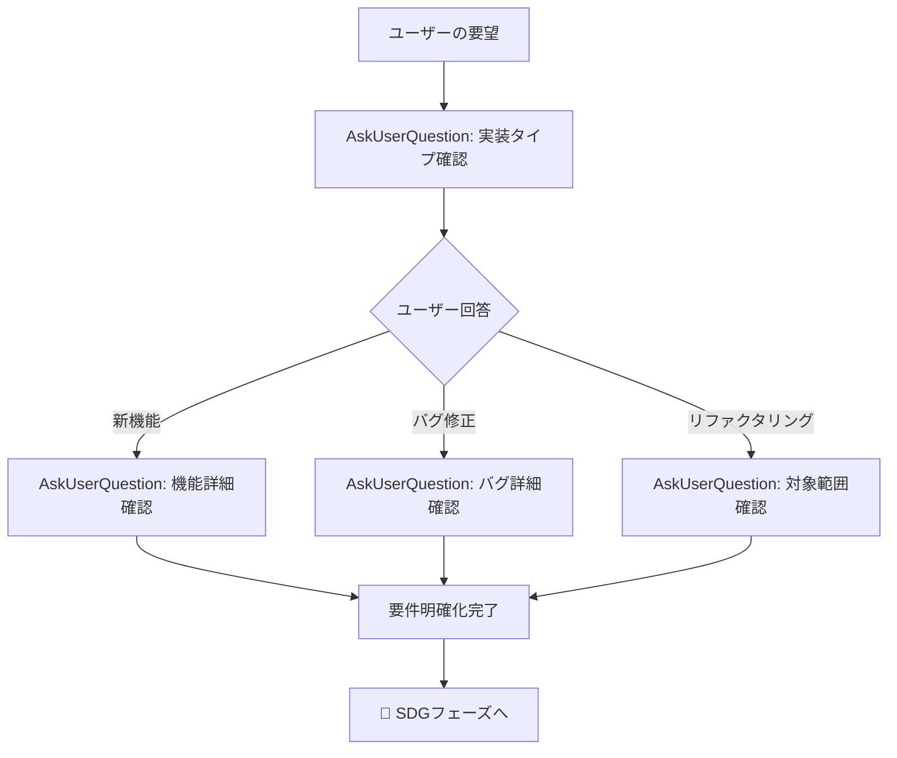

# AskUserQuestion ツール - 対話的情報収集

## 概要

AskUserQuestionは、**実装中に対話的に情報を収集するためのClaude Code内部ツール**です。

- 公開ドキュメントには詳細ページなし
- Claude Codeのシステムプロンプト内でJSONSchemaとして定義
- コード実装レベルで提供されている機能

## 使用目的

実行中に以下の目的で使用：

1. ✅ **ユーザーの好みや要件を収集**
2. ✅ **曖昧な指示を明確化**
3. ✅ **実装の選択肢について意思決定を得る**
4. ✅ **進む方向についてユーザーに選択肢を提示**

## JSONSchema仕様

```json
{
  "name": "AskUserQuestion",
  "description": "Use this tool when you need to ask the user questions during execution.",
  "parameters": {
    "type": "object",
    "properties": {
      "questions": {
        "type": "array",
        "minItems": 1,
        "maxItems": 4,
        "description": "Questions to ask the user (1-4 questions)",
        "items": {
          "type": "object",
          "required": ["question", "header", "options", "multiSelect"],
          "properties": {
            "question": {
              "type": "string",
              "description": "明確で具体的な質問文。疑問符で終わる必要がある。"
            },
            "header": {
              "type": "string",
              "description": "チップ/タグとして表示される短いラベル（最大12文字）"
            },
            "multiSelect": {
              "type": "boolean",
              "description": "複数選択を許可する場合はtrue"
            },
            "options": {
              "type": "array",
              "minItems": 2,
              "maxItems": 4,
              "description": "選択肢（2-4個必須）",
              "items": {
                "type": "object",
                "required": ["label", "description"],
                "properties": {
                  "label": {
                    "type": "string",
                    "description": "選択肢の表示テキスト（1-5語）"
                  },
                  "description": {
                    "type": "string",
                    "description": "選択肢の説明やその選択がもたらす影響"
                  }
                }
              }
            }
          }
        }
      }
    },
    "required": ["questions"]
  }
}
```

## 制約事項

| 項目 | 制約 |
|------|------|
| 質問数 | 1〜4個 |
| オプション数 | 各質問に2〜4個 |
| headerの長さ | 最大12文字 |
| labelの推奨 | 1〜5語 |
| multiSelect | 単一/複数選択の切り替え可能 |
| 自動追加 | 「Other」オプションが自動で追加される |

## 使用例

### 例1: 単一選択 - 技術スタック選択

```typescript
{
  questions: [{
    question: "どの認証方式を使用しますか？",
    header: "Auth method",
    multiSelect: false,
    options: [
      {
        label: "OAuth 2.0",
        description: "標準的な認証プロトコル、サードパーティ連携に最適"
      },
      {
        label: "JWT",
        description: "ステートレス認証、マイクロサービスに適している"
      },
      {
        label: "API Key",
        description: "シンプルな認証、内部APIに推奨"
      }
    ]
  }]
}
```

### 例2: 複数選択 - 機能選択

```typescript
{
  questions: [{
    question: "有効にする機能を選択してください（複数可）",
    header: "Features",
    multiSelect: true,
    options: [
      {
        label: "Logging",
        description: "詳細なログ記録機能を有効化"
      },
      {
        label: "Metrics",
        description: "Prometheusメトリクス収集を有効化"
      },
      {
        label: "Tracing",
        description: "分散トレーシング（OpenTelemetry）を有効化"
      }
    ]
  }]
}
```

### 例3: 複数質問 - 段階的な選択

```typescript
{
  questions: [
    {
      question: "どのWebフレームワークを使用しますか？",
      header: "Framework",
      multiSelect: false,
      options: [
        { label: "Axum", description: "tokioベースの非同期フレームワーク" },
        { label: "Actix", description: "高パフォーマンス、アクターモデル" },
        { label: "Rocket", description: "タイプセーフ、シンプルなAPI" }
      ]
    },
    {
      question: "データベースは何を使用しますか？",
      header: "Database",
      multiSelect: false,
      options: [
        { label: "PostgreSQL", description: "リレーショナルDB、JSON対応" },
        { label: "MongoDB", description: "ドキュメント指向NoSQL" },
        { label: "SQLite", description: "組み込み軽量DB" }
      ]
    }
  ]
}
```

## Hearing First手法での活用

### 一問一答フロー



### 段階的な情報収集

**ステップ1**: 大分類の確認

```typescript
AskUserQuestion({
  questions: [{
    question: "今回実装したい内容を教えてください",
    header: "Type",
    multiSelect: false,
    options: [
      { label: "新機能追加", description: "新しい機能の実装" },
      { label: "バグ修正", description: "既存機能の不具合修正" },
      { label: "リファクタリング", description: "コード構造の改善" },
      { label: "パフォーマンス改善", description: "速度・効率の向上" }
    ]
  }]
})
```

**ステップ2**: 詳細の確認（回答に基づいて次の質問）

```typescript
// 「新機能追加」が選ばれた場合
AskUserQuestion({
  questions: [{
    question: "どのような機能を追加しますか？",
    header: "Feature",
    multiSelect: false,
    options: [
      { label: "API追加", description: "新しいエンドポイント" },
      { label: "UI追加", description: "新しい画面・コンポーネント" },
      { label: "バッチ処理", description: "定期実行処理" }
    ]
  }]
})
```

**ステップ3**: 技術選択の確認

```typescript
// 「API追加」が選ばれた場合
AskUserQuestion({
  questions: [{
    question: "認証は必要ですか？",
    header: "Auth",
    multiSelect: false,
    options: [
      { label: "必要", description: "認証付きエンドポイント" },
      { label: "不要", description: "公開エンドポイント" }
    ]
  }]
})
```

## ベストプラクティス

### ✅ 良い使い方

1. **段階的に質問を深める**
   - 大きな分類から詳細へ
   - 前の回答に基づいて次の質問を調整

2. **選択肢は明確に**
   - labelは短く端的に（1-5語）
   - descriptionで詳細を補足

3. **multiSelectを適切に使う**
   - 排他的な選択: `multiSelect: false`
   - 複数組み合わせ可能: `multiSelect: true`

4. **自動「Other」を活用**
   - 予想外の回答を受け入れる余地を残す

### ❌ 避けるべき使い方

1. **一度に4個全部の質問を投げる**
   - 一問一答の原則に反する
   - ユーザーの認知負荷が高い

2. **headerが長すぎる**
   - 12文字制限を超える
   - 表示が崩れる可能性

3. **descriptionが不十分**
   - 選択の判断材料が不足
   - ユーザーが迷う

4. **選択肢が極端に偏る**
   - 誘導尋問にならないよう中立的に

## 他のツールとの組み合わせ

### TodoWrite と組み合わせ

```typescript
// 1. AskUserQuestion で要件確認
const answer = await AskUserQuestion({...})

// 2. 回答をもとにTodoWriteでタスク化
await TodoWrite({
  todos: [
    { content: `${answer}の実装`, activeForm: "実装中", status: "pending" }
  ]
})
```

### Serena memory と組み合わせ

```typescript
// 1. Serenaでプロジェクトコンテキスト読み込み
const memory = await read_memory("project-architecture")

// 2. コンテキストに基づいた質問を投げる
await AskUserQuestion({
  questions: [{
    question: `既存の${memory.framework}に追加する機能は？`,
    ...
  }]
})
```

## まとめ

- **AskUserQuestion = 対話的情報収集ツール**
- **Claude Code内部実装として提供**
- **Hearing First手法の中核ツール**
- **一問一答で段階的に要件を明確化**
- **選択肢 + 自由入力のハイブリッド**
- **他のツールと組み合わせて効果的に活用**

---

**参照**:
- [hearing-first.md](./hearing-first.md) - 一問一答手法の詳細
- [development-flow.md](./development-flow.md) - 開発フロー全体像
