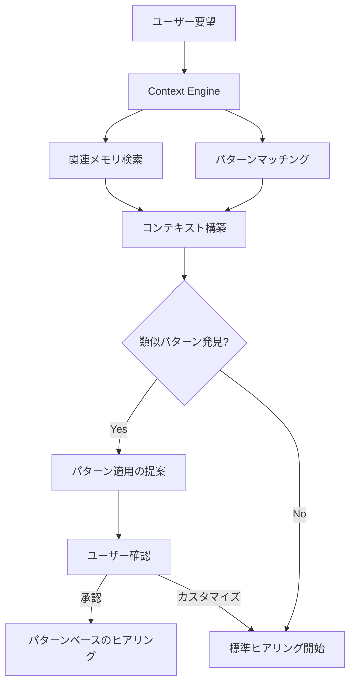

# Brain Integration - 永続的な構成可能なブレイン統合

## 概要

Code Flowに**永続的な構成可能なブレイン**（creo-memories的なシステム）を統合することで、AIエージェントが**プロジェクト横断的に学習・進化**する開発環境を実現します。

## コンセプト

### 現在のCode Flow

```
セッション単位の開発フロー:
ヒアリング → SDG → 実装 → Living Documentation
```

**制約**:
- セッション間でコンテキストが失われる
- 過去の知見が活用されない
- 同じ質問を繰り返す
- パターンが蓄積されない

### Brain統合後のCode Flow

```
永続的な学習サイクル:
ヒアリング → SDG → 実装 → Living Documentation
     ↓                ↓           ↓              ↓
   Brain蓄積     パターン保存  実装例記録  ドキュメント索引
         ↓           ↓           ↓              ↓
      次回のヒアリングで活用 → より的確な質問・設計・実装
```

**メリット**:
- ✅ セッション間でコンテキストを継承
- ✅ 過去の成功パターンを自動適用
- ✅ より的確な質問を生成
- ✅ プロジェクト横断的な知識共有
- ✅ AIの継続的な学習・進化

---

## Brain の構成要素

### 1. Memory Bank（メモリバンク）

**永続的なメモリストレージ**

```typescript
interface MemoryBank {
  // プロジェクトメモリ
  projects: {
    [projectId: string]: {
      overview: string,
      architecture: string,
      patterns: Pattern[],
      decisions: Decision[]
    }
  },

  // クロスプロジェクトメモリ
  global: {
    bestPractices: BestPractice[],
    commonPatterns: Pattern[],
    lessonLearned: Lesson[]
  }
}
```

**保存する情報**:
- プロジェクト概要・アーキテクチャ
- 設計パターン・ベストプラクティス
- 過去の意思決定と理由
- 失敗事例・教訓

**技術スタック**:
- **Serena MCP**: プロジェクトローカルメモリ
- **Akasha Memory MCP**: クロスプラットフォームメモリ
- **Notion MCP**: 構造化ドキュメント保存
- **Qdrant/SurrealDB**: ベクトル検索・構造化データ

### 2. Pattern Repository（パターンリポジトリ）

**再利用可能なパターンの蓄積**

```typescript
interface Pattern {
  id: string,
  name: string,
  category: "authentication" | "api-design" | "data-model" | ...,

  // ヒアリングパターン
  hearingQuestions: AskUserQuestion[],

  // 設計パターン
  specTemplate: string,      // SPEC.mdテンプレート
  designTemplate: string,    // DESIGN.mdテンプレート

  // 実装パターン
  codeExamples: CodeExample[],
  checklistTemplate: ChecklistItem[],

  // メタ情報
  usedCount: number,
  successRate: number,
  lastUsed: Date
}
```

**例: 認証パターン**:
```typescript
{
  id: "auth-api-key",
  name: "APIキー認証パターン",
  category: "authentication",

  hearingQuestions: [
    {
      question: "どのエンドポイントを保護しますか？",
      options: ["全エンドポイント", "特定のみ", "管理機能のみ"]
    },
    {
      question: "APIキーの保存方法は？",
      options: ["環境変数", "データベース", "設定ファイル"]
    }
  ],

  specTemplate: `
## 認証仕様

### FS-001: APIキー認証
**目的**: 不正アクセスを防ぎ、認証されたユーザーのみがAPIを使用できるようにする
...
  `,

  codeExamples: [
    {
      language: "rust",
      code: `
async fn authenticate(req: Request) -> Result<UserId, AuthError> {
    let api_key = extract_api_key(&req)?;
    validate_api_key(&api_key).await
}
      `
    }
  ]
}
```

### 3. Learning Engine（学習エンジン）

**パターンの自動発見・最適化**

```typescript
interface LearningEngine {
  // パターン発見
  discoverPatterns(sessions: Session[]): Pattern[],

  // 質問最適化
  optimizeQuestions(
    category: string,
    pastQuestions: Question[],
    outcomes: Outcome[]
  ): OptimizedQuestion[],

  // 成功率追跡
  trackSuccessRate(pattern: Pattern, outcome: Outcome): void,

  // 推奨パターン
  recommendPattern(context: Context): Pattern[]
}
```

**機能**:
- 過去のセッションから成功パターンを自動抽出
- よく使われる質問パターンを特定
- 成功率の高いパターンを優先的に推奨
- フィードバックループによる継続的な改善

### 4. Context Engine（コンテキストエンジン）

**適切なメモリの自動取得・活用**

```typescript
interface ContextEngine {
  // 関連メモリ取得
  retrieveRelevant(query: string, top_k: number): Memory[],

  // コンテキスト構築
  buildContext(userRequest: string): Context,

  // パターンマッチング
  matchPatterns(context: Context): Pattern[]
}
```

**動作**:
```
ユーザー: 「認証機能を追加して」
  ↓
Context Engine:
1. ベクトル検索で関連メモリ取得
   → 過去の認証実装 (5件)
   → 認証のベストプラクティス
   → セキュリティ考慮事項
2. パターンマッチング
   → "auth-api-key" (成功率: 95%, 使用回数: 12)
   → "auth-jwt" (成功率: 88%, 使用回数: 7)
3. コンテキスト構築
   → 推奨パターン: APIキー認証
   → 質問テンプレート: [Q1, Q2, Q3]
   → SPEC.mdテンプレート: ...
```

---

## 統合フロー

### Phase 0: Brain Consultation（ブレイン参照）

**ヒアリング前にブレインを参照**



**ユーザー体験**:
```
ユーザー: 「認証機能を追加して」
  ↓
Claude (Brain参照後):
「認証機能の追加ですね。

過去に12回、APIキー認証を実装しています（成功率95%）。
このパターンを使用しますか？

[✓] APIキー認証パターンを使用
[ ] JWT認証パターンを使用
[ ] カスタム実装（ヒアリングから開始）」
  ↓
ユーザー: 「APIキー認証パターンを使用」
  ↓
Claude:
「了解しました。APIキー認証パターンに基づいて進めます。
過去の実装から以下を準備しました：

📝 SPEC.mdテンプレート（認証仕様）
📝 DESIGN.mdテンプレート（実装設計）
✅ 実装チェックリスト

カスタマイズが必要な点を確認させてください...」
  ↓
[最小限のヒアリング]
  ↓
[パターンベースのSDG・実装]
```

### Phase 1-4: 従来のフロー + Brain蓄積

```
Phase 1: ヒアリング
  → 質問内容をBrainに記録
  → 回答パターンを分析

Phase 2: SDG
  → SPEC.md/DESIGN.mdをBrainに索引化
  → パターンとして抽出

Phase 3: 実装
  → コード実装例をBrainに記録
  → 成功/失敗を追跡

Phase 4: Living Documentation
  → ドキュメントをBrainに保存
  → 次回の参照用に最適化
```

### Phase 5: Learning & Feedback（学習とフィードバック）

**実装後の学習サイクル**

```typescript
// 実装完了後
learningEngine.recordSession({
  userRequest: "認証機能追加",
  pattern: "auth-api-key",
  hearingQuestions: [...],
  spec: "...",
  design: "...",
  implementation: "...",
  outcome: {
    success: true,
    testsPassed: true,
    userSatisfaction: 5/5
  }
})

// パターンの成功率を更新
pattern.successRate = updateSuccessRate(pattern, outcome)
pattern.usedCount += 1
pattern.lastUsed = new Date()

// 新しいパターンの発見
if (isNovelApproach(implementation)) {
  newPattern = extractPattern(session)
  patternRepository.add(newPattern)
}
```

---

## 実装アーキテクチャ

### レイヤー構成

```
┌─────────────────────────────────────┐
│      Code Flow (UI/UX Layer)      │
│  - ヒアリング                        │
│  - SDG                               │
│  - 実装                              │
│  - Living Documentation              │
└─────────────────────────────────────┘
              ↕
┌─────────────────────────────────────┐
│    Brain Integration Layer          │
│  - Context Engine                   │
│  - Learning Engine                  │
│  - Pattern Matching                 │
└─────────────────────────────────────┘
              ↕
┌─────────────────────────────────────┐
│      Storage Layer                  │
│  - Memory Bank (Serena/Akasha Memory) │
│  - Pattern Repository (Notion)      │
│  - Vector Store (Qdrant)            │
│  - Document Store (SurrealDB)       │
└─────────────────────────────────────┘
```

### データフロー

```
[User Request]
    ↓
[Context Engine] → Vector Search (Qdrant)
    ↓              → Pattern Match (Memory Bank)
[Recommended Patterns]
    ↓
[Hearing Phase] → Question Optimization (Learning Engine)
    ↓
[SDG Phase] → Template Application (Pattern Repository)
    ↓
[Implementation] → Code Example Reference (Memory Bank)
    ↓
[Living Documentation] → Index Update (Document Store)
    ↓
[Learning Phase] → Pattern Extraction (Learning Engine)
    ↓
[Memory Bank Update] → Success Rate Tracking
```

---

## 技術スタック

### 必要なMCPサーバー

| MCP Server | 役割 | 使用ツール |
|-----------|------|-----------|
| **Serena** | プロジェクトローカルメモリ | `write_memory`, `read_memory`, `list_memories` |
| **Akasha Memory** | クロスプラットフォームメモリ | `addMemory`, `search` |
| **Notion** | 構造化パターンリポジトリ | `notion-create-database`, `notion-search` |
| **Qdrant** | ベクトル検索 | Akasha MCP内蔵 |
| **SurrealDB** | 構造化データ保存 | Akasha MCP内蔵 |

### 新規実装が必要な機能

1. **Context Engine**
   ```rust
   struct ContextEngine {
       vector_store: QdrantClient,
       pattern_repo: NotionClient,
       memory_bank: SerenaClient
   }

   impl ContextEngine {
       async fn retrieve_relevant(&self, query: &str) -> Vec<Memory> {...}
       async fn match_patterns(&self, context: &Context) -> Vec<Pattern> {...}
   }
   ```

2. **Learning Engine**
   ```rust
   struct LearningEngine {
       session_tracker: SessionTracker,
       pattern_extractor: PatternExtractor
   }

   impl LearningEngine {
       fn discover_patterns(&self, sessions: &[Session]) -> Vec<Pattern> {...}
       fn optimize_questions(&self, category: &str) -> Vec<Question> {...}
   }
   ```

3. **Pattern Repository**
   ```rust
   struct PatternRepository {
       notion_db: NotionClient,
       cache: LruCache<String, Pattern>
   }

   impl PatternRepository {
       async fn add(&mut self, pattern: Pattern) {...}
       async fn find_by_category(&self, category: &str) -> Vec<Pattern> {...}
       async fn update_success_rate(&mut self, id: &str, rate: f64) {...}
   }
   ```

---

## 実装ロードマップ

### Phase 1: 基盤構築（1-2週間）

- [ ] Memory Bank設計
  - [ ] Serena memoryスキーマ定義
  - [ ] Akasha Memory連携
- [ ] Pattern Repository設計
  - [ ] Notionデータベーススキーマ
  - [ ] パターンデータ構造
- [ ] 基本的なContext Engine実装
  - [ ] ベクトル検索統合
  - [ ] 類似メモリ取得

### Phase 2: パターン機能（2-3週間）

- [ ] Pattern Repository実装
  - [ ] パターンCRUD操作
  - [ ] パターン検索
- [ ] Learning Engine (v1)
  - [ ] セッション記録
  - [ ] 成功率追跡
- [ ] Code Flow統合
  - [ ] Phase 0 追加（Brain参照）
  - [ ] パターン適用フロー

### Phase 3: 学習機能（3-4週間）

- [ ] Learning Engine (v2)
  - [ ] パターン自動抽出
  - [ ] 質問最適化
- [ ] フィードバックループ
  - [ ] 実装結果の追跡
  - [ ] パターン改善

### Phase 4: 最適化・拡張（継続的）

- [ ] パフォーマンス最適化
  - [ ] キャッシング
  - [ ] インデックス最適化
- [ ] 高度な機能
  - [ ] マルチプロジェクト分析
  - [ ] トレンド検出
  - [ ] 自動レコメンデーション

---

## 期待される効果

### 定量的な効果

| 指標 | Before | After (予想) |
|-----|--------|-------------|
| ヒアリング時間 | 10-15分 | 3-5分 |
| SPEC.md作成時間 | 15-20分 | 5-10分 |
| 実装時間 | 60分 | 40分 |
| 手戻り率 | 20% | 5% |
| パターン再利用率 | 0% | 70% |

### 定性的な効果

1. **AIの継続的な学習**
   - セッションごとに賢くなる
   - より的確な質問・提案

2. **ユーザー体験の向上**
   - 繰り返しの質問が減少
   - 過去の成功パターンを即座に適用

3. **ナレッジの蓄積**
   - プロジェクト横断的な知見
   - ベストプラクティスの自然な形成

4. **開発効率の向上**
   - テンプレートの自動生成
   - 実装例の即座の参照

---

## まとめ

**Brain統合により、Code Flowは単なる開発フローから、学習・進化する開発環境に進化します。**

### キーコンセプト

> **「一度学んだことは二度と忘れない」**

- ✅ 永続的なメモリ
- ✅ パターンの蓄積
- ✅ 継続的な学習
- ✅ 知識の共有

### ビジョン

```
個人開発者:
  セッションごとに学習
  → 個人の開発パターンを最適化

チーム開発:
  チーム全体で知識共有
  → 組織のベストプラクティスを形成

複数プロジェクト:
  プロジェクト横断的な知見
  → ドメイン知識の蓄積

AIエージェント:
  人間の経験から学習
  → 自律的な意思決定
```

**Code Flow + Brain = 自律的に学習・進化するAI開発アシスタント**

---

## 参照

- [Code Flow SKILL.md](../SKILL.md)
- [Hearing First](./hearing-first.md)
- [Development Flow](./development-flow.md)
- [Claude Code Advanced Discoveries](./claude-code-advanced-discoveries.md)
- Serena MCP: プロジェクトメモリ管理
- Akasha Memory MCP: クロスプラットフォームメモリ
- Notion MCP: 構造化ドキュメント管理
