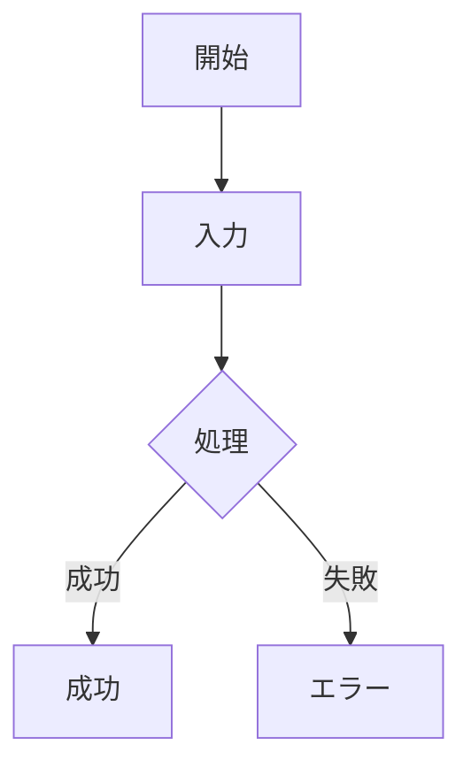
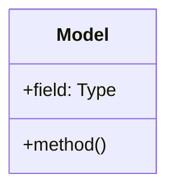

# Spec-Design-Guide Skill

このスキルは、プロジェクトの仕様・設計ドキュメント作成をガイドし、Living Documentation原則に基づいてドキュメントとコードを同期管理します。

## エイリアス

このスキルは以下のように呼ぶことができます：

- `spec-design-guide` → 「仕様設計ガイド」
- `sdg` → 「仕様設計ガイド」の略称

## 目的

実装前に仕様と設計を明確にし、実装の助けとなるドキュメントを体系的に管理します。
ドキュメントは「生きた写像」としてコードと常に同期し、技術的負債を防ぎ、生きたメモリーとして機能します。

## スキルの起動タイミング

このスキルは以下の場合に自動的に適用されます：

- ✅ コード変更・追加を行う際
- ✅ 新機能の設計・実装を行う際
- ✅ 既存機能のリファクタリングを行う際
- ✅ バグ修正で設計に影響がある際
- ✅ `spec/` ディレクトリ内のファイルを操作する際

**ユーザーがスキルを明示的に呼び出す方法**:

- `/spec-design-guide` または `/sdg` コマンド
- 「spec」「design」「SPEC.md」「設計書」などのキーワードを含む質問

## 関連リファレンス

- [Living Documentation原則](reference/living-documentation.md) - ドキュメントとコードの同期管理の詳細

## ドキュメントの役割

### spec/ - コンセプト、仕様、哲学

**What & Why** - 何を作るか、なぜ作るか

- コンセプト・ビジョン
- 設計哲学・原則
- 機能仕様
- ユーザー体験

### design/ - モデル、手法、実装

**How** - どう作るか

- データモデル
- アーキテクチャ
- 実装手法
- 技術的詳細

### guides/ - ガイド

**Usage** - どう使うか

- 使い方
- ベストプラクティス
- トラブルシューティング

## ディレクトリ構造

### 概要

ドキュメントは3つのトップレベルディレクトリに分けて管理します。
**すべてフラット構造で、番号付きファイルで管理**します：

```
spec/                          # 仕様（What & Why）- フラット、番号付き
├── 01-core-concepts.md        # コアコンセプト
├── 02-memory-store.md         # メモリストア仕様
├── 03-storage.md              # ストレージ仕様
├── 04-embeddings.md           # 埋め込み仕様
├── 05-search.md               # 検索仕様
└── 06-attachments.md          # 添付ファイル仕様

design/                        # 設計（How）- フラット、番号付き
├── 01-system-architecture.md  # システムアーキテクチャ
├── 02-data-model.md           # データモデル
├── 03-memory-store-api.md     # Memory Store API設計
├── 04-storage-integration.md  # ストレージ統合（SurrealDB + Qdrant）
├── 05-embedding-integration.md # 埋め込み統合（Plamo）
└── 06-search-implementation.md # 検索実装

guides/                        # ガイド（Usage）- フラット、番号付き
├── 01-getting-started.md      # はじめに
├── 02-local-setup.md          # ローカル環境セットアップ
└── 03-basic-operations.md     # 基本操作
```

### ディレクトリの役割

- **spec/**: 機能別に連番で管理。各機能の「何を」「なぜ」を記述。フラット構造で優先順位が明確
- **design/**: 設計種類別に連番で管理。「どう作られているか」を記述。フラット構造で重要度が明確
- **guides/**: 利用順に連番で管理。ファイル名で内容が分かる実用的なガイド。フラット構造で迷わない

## spec/ のテンプレート

**目的**: コンセプト、仕様、哲学
**ファイル名**: `spec/{連番}-{機能名}.md`（例: `spec/01-core-concepts.md`）

```markdown
# {機能名} - 仕様書

## コンセプト

### ビジョン

この機能が目指すもの、解決する問題、提供する価値。

### 哲学・設計原則

- 原則1: なぜこの設計を選んだか
- 原則2: トレードオフと判断基準
- 原則3: ユーザー体験への配慮

### 他との違い

既存のソリューションとの違い、独自性。

### システム概要図

\`\`\`mermaid
flowchart TD
A[入力] --> B[処理]
B --> C[出力]
B --> D{条件分岐}
D -->|Yes| E[処理A]
D -->|No| F[処理B]
\`\`\`

## 仕様

### 機能仕様

#### FS-001: 機能名

**目的**: この機能が何をするか

**入力/出力**:

- 入力: ...
- 出力: ...

**振る舞い**:

1. ステップ1
2. ステップ2

**制約**:

- 制約1

### インターフェース仕様

\`\`\`rust
// ユーザーが使う形式
pub fn example() {
// ...
}
\`\`\`

### 非機能仕様

- **パフォーマンス**: 期待される性能
- **セキュリティ**: セキュリティ考慮事項
- **互換性**: 後方互換性の方針

## 哲学的考察

### なぜこの仕様か

選択の理由、背景にある思想。

### ユーザー体験

ユーザーがどう感じるか、どう使うか。

### 進化の方向性

将来どう発展させるか、拡張の余地。

## 変更履歴

### YYYY-MM-DD: 変更内容

- **理由**: なぜこの変更が必要だったか
- **影響**: どのコンポーネントに影響するか
- **コミット**: コミットハッシュ
```

## design/ のテンプレート

**目的**: モデル、手法、実装
**ファイル名**: `design/{連番}-{設計種類}.md`（例: `design/01-system-architecture.md`）

```markdown
# {設計種類} - 設計書

## 設計思想: Simplicity（シンプルさ）

シンプルなコードを実現するため、以下の原則に従う。

### 型の分類

基本的に、全ての型は以下に分類される：

- **data**: 値を保持する
- **calculations**（主に同期）: 値を計算する
- **actions**（主に非同期）: 値を操作する

calculations, actionsは関数的に実装されるのが望ましい。

### Straightforward原則

入力から出力までの経路を直線的に、最小限のステップになるように、ロジックを組み立てる。

**これらの原則を守ることで、理解しやすく保守しやすいシンプルなコードが実現される。**

## データモデル

### 構造定義

\`\`\`rust
pub struct Example {
field1: Type1,
field2: Type2,
}
\`\`\`

### モデルの関係性

\`\`\`mermaid
classDiagram
class ModelA {
+field1: Type1
+field2: Type2
+method1()
}
class ModelB {
+field1: Type1
+method1()
}
class ModelC {
+field1: Type1
}
ModelA --> ModelB : uses
ModelA --> ModelC : contains
\`\`\`

## アーキテクチャ

### コンポーネント構成

\`\`\`mermaid
flowchart LR
Input[入力] --> Parser[パーサー]
Parser --> Validator[バリデーター]
Validator --> Processor[プロセッサー]
Processor --> Output[出力]
\`\`\`

### コンポーネント詳細

#### Component A

**責務**: ...
**インターフェース**:
\`\`\`rust
pub trait ComponentA {
fn method(&self) -> Result<T>;
}
\`\`\`

## 実装手法

### アルゴリズム

処理の流れ、アルゴリズムの選択理由。

\`\`\`mermaid
sequenceDiagram
participant User
participant System
participant Database

    User->>System: リクエスト
    System->>Database: データ取得
    Database-->>System: データ
    System->>System: 処理
    System-->>User: レスポンス

\`\`\`

### エラーハンドリング

\`\`\`rust #[derive(Error, Debug)]
pub enum MyError { #[error("...")]
Variant,
}
\`\`\`

### パフォーマンス最適化

- 最適化ポイント1
- 最適化ポイント2

## テスト戦略

### ユニットテスト

- テスト対象1
- テスト対象2

### 統合テスト

- シナリオ1
- シナリオ2

## 実装チェックリスト

- [ ] データモデル実装
- [ ] コア機能実装
- [ ] エラーハンドリング
- [ ] テスト作成
- [ ] ドキュメント更新

## 変更履歴

### YYYY-MM-DD: 変更内容

- **理由**: なぜこの変更が必要だったか
- **影響**: どのコンポーネントに影響するか
- **コミット**: コミットハッシュ
```

## guides/ のテンプレート

**目的**: 実用的な使い方ガイド
**ファイル名**: `guides/{連番}-{トピック名}.md`（例: `guides/01-getting-started.md`）

````markdown
# {トピック名}

## 概要

このガイドの目的と対象読者。

## 前提条件

- 必要な環境
- 必要な知識
- 必要なツール

## 手順

### ステップ1: ...

詳細な説明とコード例。

```bash
# コマンド例
```
````

### ステップ2: ...

## コード例

```typescript
// 実用的なコード例
```

## ベストプラクティス

- 推奨される使い方
- アンチパターン

## トラブルシューティング

### 問題1: ...

**症状**: ...
**原因**: ...
**解決策**: ...

## よくある質問

**Q**: ...
**A**: ...

## 次のステップ

関連するガイドへのリンク。

````

## 連番の割り当て

| 連番 | 機能               | 状態   |
| ---- | ------------------ | ------ |
| 01   | Core Concepts      | 作成済 |
| 02   | Transport Layer    | 作成済 |
| 03   | Protocol Layer     | 作成済 |
| 04   | Service Integration| 作成済 |
| 05   | Cloud Deployment   | 作成済 |
| 06   | Local Storage      | 作成済 |
| 07   | HTTP Transport     | 作成済 |

## ワークフロー

### 新機能追加時

1. **spec/** に機能仕様を追加
   - 次の連番を決定（既存の最大連番 + 1）
   - `spec/{連番}-{機能名}.md` を作成（コンセプト・仕様・哲学）
   - 例: `spec/07-realtime-sync.md`

2. **design/** に設計を追加
   - 設計の種類を決定（architecture, data-model, api, integrationなど）
   - 次の連番を決定（既存の最大連番 + 1）
   - `design/{連番}-{設計種類}.md` を作成
   - 例: `design/07-realtime-architecture.md`

3. **guides/** に使い方を追加（必要に応じて）
   - 次の連番を決定（既存の最大連番 + 1）
   - `guides/{連番}-{トピック}.md` を作成
   - 例: `guides/04-realtime-usage.md`

4. 実装開始

5. 実装完了後、ドキュメント更新

### 既存機能修正時

1. **spec/** で該当機能のファイルを確認（例: `spec/02-memory-store.md`）
2. **design/** で関連する設計ファイルを確認（例: `design/03-memory-store-api.md`）
3. 変更が設計に影響する場合、該当ファイルを更新
4. 実装
5. 必要に応じて **guides/** も更新（例: `guides/03-basic-operations.md`）

### ドキュメント構造の判断基準

**spec/に入れるもの**:
- 機能の「何を」「なぜ」
- ビジネス要件
- ユーザーストーリー
- 連番で優先順位を表現

**design/に入れるもの**:
- 技術的な「どう作るか」
- アーキテクチャ、データモデル、API設計、統合設計
- 連番で重要度を表現

**guides/に入れるもの**:
- 実用的な「どう使うか」
- セットアップ手順、使用例
- 連番で利用順序を表現

### ドキュメント追加の原則

**既存ドキュメントへの追記を優先**:
- 新しい情報を追加する際は、まず既存のドキュメントに含めるのが適切かを検討
- 既存ドキュメントのスコープ内であれば、そちらに追記する
- なるべくドキュメントの種類を増やさない運用を心がける

**新規ドキュメント作成の判断基準**:
- 既存ドキュメントのスコープを超える新しいトピック
- 独立した機能・設計・ガイドとして扱うべき内容
- 既存ドキュメントに追記すると焦点がぼやける場合

**追記時の注意点**:
- セクション構造を維持
- 変更履歴に追記内容を記録
- 関連する他のドキュメントも更新が必要か確認

### ドキュメント構造の定期的な見直し

**見直しのタイミング**:
- 新機能追加時
- 大きな設計変更時
- ドキュメント数が増えてきた時
- ユーザーからドキュメントに関するフィードバックがあった時

**見直しの観点**:
- **整理統合**: 似た内容のドキュメントを統合できないか
- **分割**: 1つのドキュメントが大きくなりすぎていないか
- **連番の再割り当て**: 優先順位・重要度・順序が適切か
- **命名**: ファイル名が内容を適切に表現しているか
- **スコープ**: 各ドキュメントのスコープが明確で重複がないか

**見直しの実施**:
- 構造変更が必要な場合は、ユーザーと相談
- 変更履歴に構造見直しの理由を記録
- 関連する全てのドキュメントを一度に更新

## 実践例

### 機能追加の例

新機能「リアルタイム同期」を追加する場合：

```bash
# 1. 仕様を作成
vim spec/07-realtime-sync.md

# 2. 設計を作成
vim design/07-realtime-architecture.md

# 3. ガイドを作成
vim guides/04-realtime-usage.md

# 4. 実装
# コードを書く...

# 5. コミット
git add spec/07-realtime-sync.md design/07-realtime-architecture.md
git add guides/04-realtime-usage.md packages/creo-memories/src/realtime/
git commit -m "feat: リアルタイム同期機能を追加

## 仕様
- spec/07-realtime-sync.md: リアルタイム同期の仕様

## 設計
- design/07-realtime-architecture.md: リアルタイムアーキテクチャ

## ガイド
- guides/04-realtime-usage.md: 使い方ガイド

## コード
- packages/creo-memories/src/realtime/: リアルタイム機能の実装

## 理由
複数クライアント間でのメモリ同期を実現するため
"
````

### 設計変更の例

データモデルを変更する場合：

```bash
# 1. 該当する仕様を確認
cat spec/01-core-concepts.md

# 2. 設計ドキュメントを更新
vim design/02-data-model.md

# 3. 影響するコードを更新
# コードを変更...

# 4. コミット
git add design/02-data-model.md packages/creo-core/src/types/
git commit -m "refactor: メモリ構造を改善

## 設計変更
- design/02-data-model.md: メタデータ構造を拡張

## コード変更
- packages/creo-core/src/types/memory.ts: Memory型を更新

## 理由
より柔軟なメタデータ管理のため
"
```

## Claudeへの指示

**重要**: このスキルが有効な場合、コード変更を提案・実装する際は必ず以下を実行してください：

### 設計思想: Simplicity（シンプルさ）の追求

コード設計・実装時は、**Simplicity（シンプルさ）** を最優先してください。
以下の原則を守ることで、理解しやすく保守しやすいコードを実現します。

#### 型の分類

全ての型は以下に分類されます：

- **data**: 値を保持する不変データ構造
  - 例: `struct User { id: UserId, name: String }`
  - 純粋なデータ、ビジネスロジックを持たない

- **calculations**（主に同期）: 値を計算する純粋関数
  - 例: `fn calculate_total(items: &[Item]) -> Money`
  - 副作用なし、同じ入力に対して常に同じ出力
  - 関数的に実装（引数を受け取り、結果を返す）

- **actions**（主に非同期）: 値を操作する副作用のある関数
  - 例: `async fn save_user(user: &User) -> Result<()>`
  - I/O、状態変更、外部システムとの通信
  - 関数的に実装（引数を受け取り、Resultを返す）

#### Straightforward原則

- 入力から出力までの経路を**直線的**に
- **最小限のステップ**でロジックを組み立てる
- 不要な中間層、抽象化、間接参照を避ける
- コードの流れが追いやすく、理解しやすいことを優先

**→ これらの原則 = Simplicity（シンプルさ）の実現**

### コード変更時の必須手順

1. ✅ 変更対象の機能に対応する`spec/{連番}-{機能名}.md`を特定
2. ✅ spec/ファイルを読んで「なぜ」（What & Why）を理解
3. ✅ `design/`配下の関連する設計ファイルを特定して読む（How）
   - システム全体 → `design/01-system-architecture.md`
   - データモデル変更 → `design/02-data-model.md`
   - API変更 → `design/03-memory-store-api.md`
   - ストレージ統合変更 → `design/04-storage-integration.md`
   - 埋め込み統合変更 → `design/05-embedding-integration.md`
   - 検索実装変更 → `design/06-search-implementation.md`
4. ✅ コード変更を実施
5. ✅ spec/およびdesign/ファイルとの乖離をチェック
6. ✅ 乖離があればドキュメントを更新
7. ✅ 必要に応じて`guides/`も更新
8. ✅ 各ドキュメントの変更履歴セクションを更新

### 視覚化の推奨

**マーメイド図を積極的に活用**してください：

#### SPEC.mdでの図の使用

- ✅ **フローチャート**: システムの処理の流れ、ユーザーの操作フロー
- ✅ **状態遷移図**: ステートマシン、ライフサイクル
- ✅ **シーケンス図**: ユーザーとシステムの対話



#### DESIGN.mdでの図の使用

- ✅ **クラス図**: データモデルの関係性
- ✅ **フローチャート**: アーキテクチャ、コンポーネント構成
- ✅ **シーケンス図**: コンポーネント間の相互作用
- ✅ **ER図**: データベース設計（該当する場合）



#### 図を使うべき場面

- ✅ テキストで説明すると長くなる時
- ✅ 関係性が複雑な時
- ✅ フローや手順を示す時
- ✅ 全体像を理解しやすくしたい時

#### マーメイド図の種類

| 図の種類          | 用途                       | 使用例                            |
| ----------------- | -------------------------- | --------------------------------- |
| `flowchart`       | 処理フロー、アーキテクチャ | システム概要、コンポーネント構成  |
| `sequenceDiagram` | 時系列の相互作用           | API呼び出し、メッセージングフロー |
| `classDiagram`    | データモデル               | 構造体、クラスの関係性            |
| `stateDiagram`    | 状態遷移                   | ライフサイクル、ステートマシン    |
| `erDiagram`       | データベース設計           | テーブル関係、エンティティ        |

### ドキュメント追加・更新の原則

**既存ドキュメントへの追記を最優先**:

- 新しい情報を追加する際は、必ず既存のドキュメントに含められないか検討
- 既存ドキュメントのスコープ内であれば、そちらに追記する
- ドキュメントの種類を無闇に増やさない

**新規ドキュメント作成の判断**:

- 既存ドキュメントのスコープを明らかに超える内容
- 独立したトピックとして扱うべき内容
- 既存ドキュメントに追記すると焦点がぼやける場合
- この場合は遠慮なく新規ドキュメントを作成

### 禁止事項

- ❌ spec/を確認せずにコード変更
- ❌ design/の関連ファイルを確認せずに設計変更
- ❌ ドキュメント更新を忘れる
- ❌ 古い情報を放置
- ❌ 実装とドキュメントの不一致を許容
- ❌ 図で表現できるものをテキストだけで説明
- ❌ 既存ドキュメントに追記できる内容を新規ドキュメントとして作成

### コミット時の推奨フォーマット

```
{変更内容の要約}

## 仕様（該当する場合）
- spec/{連番}-{機能名}/SPEC.md: 更新内容

## 設計（該当する場合）
- design/architecture/xxx.md: 更新内容
- design/data-model/yyy.md: 更新内容
- design/api/zzz.md: 更新内容

## ガイド（該当する場合）
- guides/usage/aaa.md: 更新内容

## コード変更
- src/xxx.ts: 変更内容
- packages/yyy/: 変更内容

## 理由
なぜこの変更が必要だったか

## 影響範囲
この変更が影響する範囲
```

### Living Documentation原則

> **ドキュメントは死んだテキストではなく、生きたコードベースの鏡である**

#### 基本原則

- ドキュメントとコードは常に同期
- 一方が変われば他方も変わる
- 不一致は技術的負債（バグ）として扱う

#### 生きたメモリーとしての機能

ドキュメントは**AIエージェント（Claude）が信頼して活用できる生きたメモリー**として機能する：

- ✅ **常に新鮮**: 最新のコード状態を正確に反映
- ✅ **信頼できる**: 実装と完全に一致し、嘘がない
- ✅ **活用可能**: AIエージェントが読んで理解し、意思決定の根拠にできる
- ✅ **進化する**: コードの変化とともに成長・更新される

**AIエージェントの活用シナリオ**:

- コード変更時にSPEC.mdを読んで「なぜ」を理解
- DESIGN.mdを参照して設計意図を把握
- 変更履歴から過去の判断理由を学習
- ドキュメントを信頼して自律的に作業

詳細は [Living Documentation原則](reference/living-documentation.md) を参照。

## ベストプラクティス

### spec/ - 仕様（What & Why）

- **Why重視**: なぜその選択をしたか
- **ユーザー視点**: 技術詳細より価値を重視
- **哲学を語る**: 設計思想を明確に
- **変更履歴**: 全ての変更を記録
- **視覚化**: フローチャートや状態図で全体像を示す
- **フラット構造**: 連番で優先順位を管理、ファイル名で機能が分かる

### design/ - 設計（How）

- **How重視**: どう実装するか
- **Simplicity**: 型分類とStraightforward原則でシンプルさを実現
- **実装可能に**: コードに落とし込める粒度
- **技術的詳細**: データ構造、アルゴリズム
- **フラット構造**: 連番で重要度を管理、ファイル名で設計種類が分かる
- **視覚化**: クラス図、シーケンス図、アーキテクチャ図で設計を明確に

### guides/ - ガイド（Usage）

- **実用的**: すぐ使える例
- **段階的**: 簡単→複雑へ
- **トラブル対応**: よくある問題と解決策
- **フラット構造**: 連番で利用順序を管理、ファイル名でトピックが分かる
- **視覚化**: 使用フロー図で操作手順を分かりやすく

## まとめ

このスキルは、仕様と設計を明確にし、Living Documentation原則に基づいてドキュメントとコードを同期させることで、プロジェクトの品質と保守性を高めます。

**キーポイント**:

- 📝 **spec/**: What & Why（フラット構造・連番で優先順位管理）
- 🏗️ **design/**: How（フラット構造・連番で重要度管理）
- 📖 **guides/**: Usage（フラット構造・連番で利用順序管理）
- 🎯 **Simplicity**: 型分類 + Straightforward原則 = シンプルさ
- 🔄 **Living Documentation**: ドキュメントとコードの同期
- ✅ **実装チェックリスト**: 進捗の可視化
- 📊 **マーメイド図**: 積極的な視覚化で理解しやすく
- 📁 **フラット構造**: すべてのドキュメントをフラットに配置、番号付きで管理
- 🔢 **連番管理**: ファイル名の番号で優先順位・重要度・順序を表現
