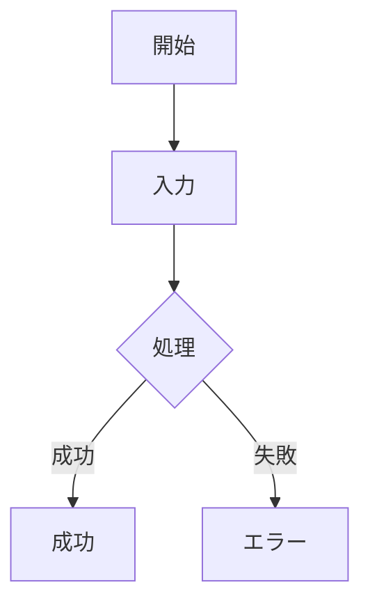
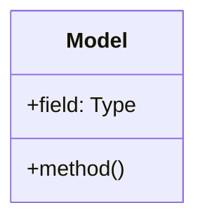

# Spec-Design-Guide Skill

このスキルは、プロジェクトの仕様・設計ドキュメント作成をガイドし、Living Documentation原則に基づいてドキュメントとコードを同期管理します。

## エイリアス

このスキルは以下のように呼ぶことができます：

- `spec-design-guide` → 「仕様設計ガイド」
- `sdg` → 「仕様設計ガイド」の略称

## 目的

実装前に仕様と設計を明確にし、実装の助けとなるドキュメントを体系的に管理します。
ドキュメントは「生きた写像」としてコードと常に同期し、技術的負債を防ぎ、生きたメモリーとして機能します。

## スキルの起動タイミング

このスキルは以下の場合に自動的に適用されます：

- ✅ コード変更・追加を行う際
- ✅ 新機能の設計・実装を行う際
- ✅ 既存機能のリファクタリングを行う際
- ✅ バグ修正で設計に影響がある際
- ✅ `spec/` ディレクトリ内のファイルを操作する際

**ユーザーがスキルを明示的に呼び出す方法**:
- `/spec-design-guide` または `/sdg` コマンド
- 「spec」「design」「SPEC.md」「設計書」などのキーワードを含む質問

## 関連リファレンス

- [Living Documentation原則](reference/living-documentation.md) - ドキュメントとコードの同期管理の詳細

## ドキュメントの役割

### SPEC.md - コンセプト、仕様、哲学

**What & Why** - 何を作るか、なぜ作るか

- コンセプト・ビジョン
- 設計哲学・原則
- 機能仕様
- ユーザー体験

### DESIGN.md - モデル、手法、実装

**How** - どう作るか

- データモデル
- アーキテクチャ
- 実装手法
- 技術的詳細

### GUIDE.md - ガイド

**Usage** - どう使うか

- 使い方
- ベストプラクティス
- トラブルシューティング

## ディレクトリ構造

```
spec/
├── 01-core-concept/
│   ├── SPEC.md      # コンセプト・仕様・哲学
│   ├── DESIGN.md    # モデル・手法・実装
│   └── GUIDE.md     # 使い方ガイド（オプション）
├── 02-kdl-parser/
│   ├── SPEC.md
│   └── DESIGN.md
└── ...
```

## SPEC.md のテンプレート

**目的**: コンセプト、仕様、哲学

```markdown
# {機能名} - 仕様書

## コンセプト

### ビジョン

この機能が目指すもの、解決する問題、提供する価値。

### 哲学・設計原則

- 原則1: なぜこの設計を選んだか
- 原則2: トレードオフと判断基準
- 原則3: ユーザー体験への配慮

### 他との違い

既存のソリューションとの違い、独自性。

### システム概要図

\`\`\`mermaid
flowchart TD
    A[入力] --> B[処理]
    B --> C[出力]
    B --> D{条件分岐}
    D -->|Yes| E[処理A]
    D -->|No| F[処理B]
\`\`\`

## 仕様

### 機能仕様

#### FS-001: 機能名

**目的**: この機能が何をするか

**入力/出力**:

- 入力: ...
- 出力: ...

**振る舞い**:

1. ステップ1
2. ステップ2

**制約**:

- 制約1

### インターフェース仕様

\`\`\`rust
// ユーザーが使う形式
pub fn example() {
    // ...
}
\`\`\`

### 非機能仕様

- **パフォーマンス**: 期待される性能
- **セキュリティ**: セキュリティ考慮事項
- **互換性**: 後方互換性の方針

## 哲学的考察

### なぜこの仕様か

選択の理由、背景にある思想。

### ユーザー体験

ユーザーがどう感じるか、どう使うか。

### 進化の方向性

将来どう発展させるか、拡張の余地。

## 変更履歴

### YYYY-MM-DD: 変更内容
- **理由**: なぜこの変更が必要だったか
- **影響**: どのコンポーネントに影響するか
- **コミット**: コミットハッシュ
```

## DESIGN.md のテンプレート

**目的**: モデル、手法、実装

```markdown
# {機能名} - 設計書

## 設計思想: Simplicity（シンプルさ）

シンプルなコードを実現するため、以下の原則に従う。

### 型の分類

基本的に、全ての型は以下に分類される：

- **data**: 値を保持する
- **calculations**（主に同期）: 値を計算する
- **actions**（主に非同期）: 値を操作する

calculations, actionsは関数的に実装されるのが望ましい。

### Straightforward原則

入力から出力までの経路を直線的に、最小限のステップになるように、ロジックを組み立てる。

**これらの原則を守ることで、理解しやすく保守しやすいシンプルなコードが実現される。**

## データモデル

### 構造定義

\`\`\`rust
pub struct Example {
    field1: Type1,
    field2: Type2,
}
\`\`\`

### モデルの関係性

\`\`\`mermaid
classDiagram
    class ModelA {
        +field1: Type1
        +field2: Type2
        +method1()
    }
    class ModelB {
        +field1: Type1
        +method1()
    }
    class ModelC {
        +field1: Type1
    }
    ModelA --> ModelB : uses
    ModelA --> ModelC : contains
\`\`\`

## アーキテクチャ

### コンポーネント構成

\`\`\`mermaid
flowchart LR
    Input[入力] --> Parser[パーサー]
    Parser --> Validator[バリデーター]
    Validator --> Processor[プロセッサー]
    Processor --> Output[出力]
\`\`\`

### コンポーネント詳細

#### Component A

**責務**: ...
**インターフェース**:
\`\`\`rust
pub trait ComponentA {
    fn method(&self) -> Result<T>;
}
\`\`\`

## 実装手法

### アルゴリズム

処理の流れ、アルゴリズムの選択理由。

\`\`\`mermaid
sequenceDiagram
    participant User
    participant System
    participant Database

    User->>System: リクエスト
    System->>Database: データ取得
    Database-->>System: データ
    System->>System: 処理
    System-->>User: レスポンス
\`\`\`

### エラーハンドリング

\`\`\`rust
#[derive(Error, Debug)]
pub enum MyError {
    #[error("...")]
    Variant,
}
\`\`\`

### パフォーマンス最適化

- 最適化ポイント1
- 最適化ポイント2

## テスト戦略

### ユニットテスト

- テスト対象1
- テスト対象2

### 統合テスト

- シナリオ1
- シナリオ2

## 実装チェックリスト

- [ ] データモデル実装
- [ ] コア機能実装
- [ ] エラーハンドリング
- [ ] テスト作成
- [ ] ドキュメント更新

## 変更履歴

### YYYY-MM-DD: 変更内容
- **理由**: なぜこの変更が必要だったか
- **影響**: どのコンポーネントに影響するか
- **コミット**: コミットハッシュ
```

## GUIDE.md のテンプレート（オプション）

**目的**: 使い方ガイド

```markdown
# {機能名} - ガイド

## クイックスタート

最小限の使用例。

## 基本的な使い方

### ケース1: ...

説明と例。

### ケース2: ...

## ベストプラクティス

- 推奨される使い方
- アンチパターン

## トラブルシューティング

### 問題1: ...

**原因**: ...
**解決策**: ...
```

## 連番の割り当て

| 連番 | 機能               | 状態   |
| ---- | ------------------ | ------ |
| 01   | Core Concepts      | 作成済 |
| 02   | Transport Layer    | 作成済 |
| 03   | Protocol Layer     | 作成済 |
| 04   | Service Integration| 作成済 |
| 05   | Cloud Deployment   | 作成済 |
| 06   | Local Storage      | 作成済 |
| 07   | HTTP Transport     | 作成済 |

## ワークフロー

### 新機能追加時

1. `spec/{連番}-{機能名}/` を作成
2. SPEC.md を作成（コンセプト・仕様・哲学）
3. DESIGN.md を作成（モデル・手法・実装）
4. （必要なら）GUIDE.md を作成
5. 実装開始
6. 実装完了後、ドキュメント更新

### 既存機能修正時

1. 該当するspec/ディレクトリを確認
2. SPEC.md/DESIGN.mdを読んで理解
3. 必要に応じてドキュメント更新
4. 実装

## Akasha MCPプロジェクトでの適用

### spec/とコードの対応表

| spec/ディレクトリ | 対応するコード |
|-----------------|--------------|
| 01-core-concepts | `src/memory/types.rs`, `src/memory/creare.rs`, `src/memory/attachment.rs` |
| 02-transport-layer | `src/server/transport.rs` |
| 03-protocol-layer | `src/server/protocol.rs`, `src/server/mod.rs` |
| 04-service-integration | `src/tools/` |
| 06-local-storage | `src/memory/storage.rs`, `src/memory/qdrant.rs`, `src/memory/accessor.rs` |
| 07-http-transport | HTTPトランスポート実装 |

### 例: 機能の変更時

```bash
# 1. spec/を確認
cat spec/01-feature-name/SPEC.md
cat spec/02-another-feature/SPEC.md

# 2. コード変更
vim src/module/feature.rs

# 3. ドキュメント更新
vim spec/01-feature-name/SPEC.md

# 4. 両方をコミット
git add src/module/feature.rs spec/01-feature-name/SPEC.md
git commit -m "機能改善とドキュメント更新

## コード変更
- src/module/feature.rs: 新機能を追加

## ドキュメント更新
- spec/01-feature-name/SPEC.md: 仕様を追加

## 理由
ユーザー要望に基づく機能強化のため
"
```

## Claudeへの指示

**重要**: このスキルが有効な場合、コード変更を提案・実装する際は必ず以下を実行してください：

### 設計思想: Simplicity（シンプルさ）の追求

コード設計・実装時は、**Simplicity（シンプルさ）** を最優先してください。
以下の原則を守ることで、理解しやすく保守しやすいコードを実現します。

#### 型の分類

全ての型は以下に分類されます：

- **data**: 値を保持する不変データ構造
  - 例: `struct User { id: UserId, name: String }`
  - 純粋なデータ、ビジネスロジックを持たない

- **calculations**（主に同期）: 値を計算する純粋関数
  - 例: `fn calculate_total(items: &[Item]) -> Money`
  - 副作用なし、同じ入力に対して常に同じ出力
  - 関数的に実装（引数を受け取り、結果を返す）

- **actions**（主に非同期）: 値を操作する副作用のある関数
  - 例: `async fn save_user(user: &User) -> Result<()>`
  - I/O、状態変更、外部システムとの通信
  - 関数的に実装（引数を受け取り、Resultを返す）

#### Straightforward原則

- 入力から出力までの経路を**直線的**に
- **最小限のステップ**でロジックを組み立てる
- 不要な中間層、抽象化、間接参照を避ける
- コードの流れが追いやすく、理解しやすいことを優先

**→ これらの原則 = Simplicity（シンプルさ）の実現**

### コード変更時の必須手順

1. ✅ 変更対象のコードに対応する`spec/XX-YY/`を特定
2. ✅ SPEC.mdを読んで「なぜ」（What & Why）を理解
3. ✅ DESIGN.mdを読んで「どう実装するか」（How）を理解
4. ✅ コード変更を実施
5. ✅ SPEC.md/DESIGN.mdとの乖離をチェック
6. ✅ 乖離があればドキュメントを更新
7. ✅ 実装チェックリストを更新
8. ✅ 変更履歴セクションを更新

### 視覚化の推奨

**マーメイド図を積極的に活用**してください：

#### SPEC.mdでの図の使用

- ✅ **フローチャート**: システムの処理の流れ、ユーザーの操作フロー
- ✅ **状態遷移図**: ステートマシン、ライフサイクル
- ✅ **シーケンス図**: ユーザーとシステムの対話



#### DESIGN.mdでの図の使用

- ✅ **クラス図**: データモデルの関係性
- ✅ **フローチャート**: アーキテクチャ、コンポーネント構成
- ✅ **シーケンス図**: コンポーネント間の相互作用
- ✅ **ER図**: データベース設計（該当する場合）



#### 図を使うべき場面

- ✅ テキストで説明すると長くなる時
- ✅ 関係性が複雑な時
- ✅ フローや手順を示す時
- ✅ 全体像を理解しやすくしたい時

#### マーメイド図の種類

| 図の種類 | 用途 | 使用例 |
|---------|------|--------|
| `flowchart` | 処理フロー、アーキテクチャ | システム概要、コンポーネント構成 |
| `sequenceDiagram` | 時系列の相互作用 | API呼び出し、メッセージングフロー |
| `classDiagram` | データモデル | 構造体、クラスの関係性 |
| `stateDiagram` | 状態遷移 | ライフサイクル、ステートマシン |
| `erDiagram` | データベース設計 | テーブル関係、エンティティ |

### 禁止事項

- ❌ spec/を確認せずにコード変更
- ❌ ドキュメント更新を忘れる
- ❌ 古い情報を放置
- ❌ 実装とドキュメントの不一致を許容
- ❌ 図で表現できるものをテキストだけで説明

### コミット時の推奨フォーマット

```
{変更内容の要約}

## コード変更
- src/xxx.rs: 変更内容

## ドキュメント更新
- spec/XX-YY/SPEC.md: 更新内容
- spec/XX-YY/DESIGN.md: 更新内容

## 理由
なぜこの変更が必要だったか

## 影響範囲
この変更が影響する範囲
```

### Living Documentation原則

> **ドキュメントは死んだテキストではなく、生きたコードベースの鏡である**

#### 基本原則

- ドキュメントとコードは常に同期
- 一方が変われば他方も変わる
- 不一致は技術的負債（バグ）として扱う

#### 生きたメモリーとしての機能

ドキュメントは**AIエージェント（Claude）が信頼して活用できる生きたメモリー**として機能する：

- ✅ **常に新鮮**: 最新のコード状態を正確に反映
- ✅ **信頼できる**: 実装と完全に一致し、嘘がない
- ✅ **活用可能**: AIエージェントが読んで理解し、意思決定の根拠にできる
- ✅ **進化する**: コードの変化とともに成長・更新される

**AIエージェントの活用シナリオ**:
- コード変更時にSPEC.mdを読んで「なぜ」を理解
- DESIGN.mdを参照して設計意図を把握
- 変更履歴から過去の判断理由を学習
- ドキュメントを信頼して自律的に作業

詳細は [Living Documentation原則](reference/living-documentation.md) を参照。

## ベストプラクティス

### SPEC.md（コンセプト・仕様・哲学）

- **Why重視**: なぜその選択をしたか
- **ユーザー視点**: 技術詳細より価値を重視
- **哲学を語る**: 設計思想を明確に
- **変更履歴**: 全ての変更を記録
- **視覚化**: フローチャートや状態図で全体像を示す

### DESIGN.md（モデル・手法・実装）

- **How重視**: どう実装するか
- **Simplicity**: 型分類とStraightforward原則でシンプルさを実現
- **実装可能に**: コードに落とし込める粒度
- **技術的詳細**: データ構造、アルゴリズム
- **チェックリスト**: 実装の進捗を追跡
- **視覚化**: クラス図、シーケンス図、アーキテクチャ図で設計を明確に

### GUIDE.md（使い方）

- **実用的**: すぐ使える例
- **段階的**: 簡単→複雑へ
- **トラブル対応**: よくある問題と解決策
- **視覚化**: 使用フロー図で操作手順を分かりやすく

## まとめ

このスキルは、仕様と設計を明確にし、Living Documentation原則に基づいてドキュメントとコードを同期させることで、プロジェクトの品質と保守性を高めます。

**キーポイント**:
- 📝 SPEC.md: What & Why（コンセプト・仕様・哲学）
- 🏗️ DESIGN.md: How（モデル・手法・実装）
- 📖 GUIDE.md: Usage（使い方）
- 🎯 Simplicity: 型分類 + Straightforward原則 = シンプルさ
- 🔄 Living Documentation: ドキュメントとコードの同期
- ✅ 実装チェックリスト: 進捗の可視化
- 📊 マーメイド図: 積極的な視覚化で理解しやすく
