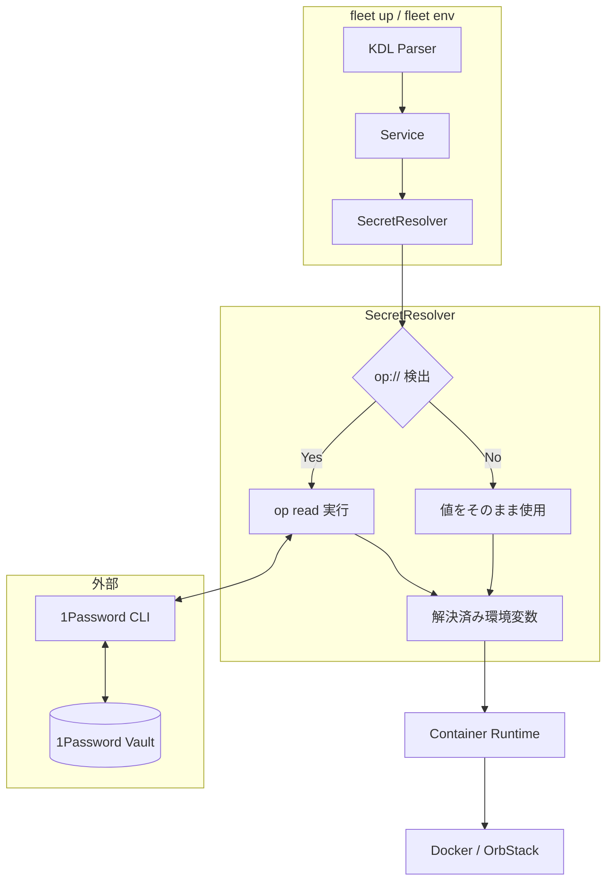

# 12. 1Password 統合 設計書

## アーキテクチャ概要



**設計方針**: キャッシュは行わない。常に1Passwordから最新値を取得し、値の不整合による混乱を防ぐ。

## モジュール構成

### 新規クレート: `fleetflow-secrets`

```
crates/fleetflow-secrets/
├── Cargo.toml
└── src/
    ├── lib.rs
    ├── resolver.rs      # SecretResolver
    ├── onepassword.rs   # 1Password CLI連携
    └── error.rs         # エラー型
```

### 依存関係

```
fleetflow (CLI)
    └── fleetflow-container
            └── fleetflow-secrets (新規)
                    └── fleetflow-core
```

## 主要コンポーネント

### 1. SecretResolver

環境変数内の`op://`参照を解決する中心コンポーネント。

```rust
// crates/fleetflow-secrets/src/resolver.rs

use std::collections::HashMap;

pub struct SecretResolver {
    onepassword: OnePasswordCli,
}

impl SecretResolver {
    pub fn new() -> Result<Self, SecretError> {
        Ok(Self {
            onepassword: OnePasswordCli::new()?,
        })
    }

    /// 環境変数マップ内のop://参照を解決
    pub async fn resolve_environment(
        &self,
        env: &HashMap<String, String>,
    ) -> Result<HashMap<String, String>, SecretError> {
        let mut resolved = HashMap::new();

        for (key, value) in env {
            let resolved_value = if value.starts_with("op://") {
                self.onepassword.read(value).await?
            } else {
                value.clone()
            };
            resolved.insert(key.clone(), resolved_value);
        }

        Ok(resolved)
    }

    /// 参照の有効性のみチェック（値は取得しない）
    pub async fn validate_reference(&self, reference: &str) -> Result<(), SecretError> {
        self.onepassword.validate(reference).await
    }
}
```

### 2. OnePasswordCli

1Password CLIとのインターフェース。

```rust
// crates/fleetflow-secrets/src/onepassword.rs

use std::process::Command;

pub struct OnePasswordCli {
    command: String,  // "op" or カスタムパス
}

impl OnePasswordCli {
    pub fn new() -> Result<Self, SecretError> {
        // op コマンドの存在確認
        let output = Command::new("op")
            .arg("--version")
            .output()
            .map_err(|_| SecretError::OpCliNotFound)?;

        if !output.status.success() {
            return Err(SecretError::OpCliNotFound);
        }

        Ok(Self {
            command: "op".to_string(),
        })
    }

    /// op read でシークレットを取得
    pub async fn read(&self, reference: &str) -> Result<String, SecretError> {
        let output = tokio::process::Command::new(&self.command)
            .args(["read", reference])
            .output()
            .await
            .map_err(SecretError::CommandFailed)?;

        if !output.status.success() {
            let stderr = String::from_utf8_lossy(&output.stderr);
            return Err(self.parse_error(&stderr, reference));
        }

        // 末尾の改行を除去
        let value = String::from_utf8_lossy(&output.stdout)
            .trim_end()
            .to_string();

        Ok(value)
    }

    /// 参照の有効性チェック（--exists フラグ相当）
    pub async fn validate(&self, reference: &str) -> Result<(), SecretError> {
        // op read を実行して成功するか確認
        // TODO: より効率的な方法があれば置き換え
        self.read(reference).await.map(|_| ())
    }

    fn parse_error(&self, stderr: &str, reference: &str) -> SecretError {
        if stderr.contains("not signed in") || stderr.contains("session expired") {
            SecretError::NotSignedIn
        } else if stderr.contains("vault") && stderr.contains("not found") {
            SecretError::VaultNotFound(reference.to_string())
        } else if stderr.contains("item") && stderr.contains("not found") {
            SecretError::ItemNotFound(reference.to_string())
        } else if stderr.contains("field") && stderr.contains("not found") {
            SecretError::FieldNotFound(reference.to_string())
        } else if stderr.contains("network") || stderr.contains("connection") {
            SecretError::NetworkError(stderr.to_string())
        } else {
            SecretError::OpReadFailed {
                reference: reference.to_string(),
                message: stderr.to_string(),
            }
        }
    }
}
```

### 3. エラー型

```rust
// crates/fleetflow-secrets/src/error.rs

use thiserror::Error;

#[derive(Debug, Error)]
pub enum SecretError {
    #[error("1Password CLI (op) が見つかりません。インストールしてください: https://1password.com/downloads/command-line/")]
    OpCliNotFound,

    #[error("1Passwordにサインインしていません。`op signin` を実行してください")]
    NotSignedIn,

    #[error("Vault が見つかりません: {0}")]
    VaultNotFound(String),

    #[error("アイテムが見つかりません: {0}")]
    ItemNotFound(String),

    #[error("フィールドが見つかりません: {0}")]
    FieldNotFound(String),

    #[error("ネットワークエラー: {0}")]
    NetworkError(String),

    #[error("シークレット参照の解決に失敗: {reference}\n{message}")]
    OpReadFailed { reference: String, message: String },

    #[error("コマンド実行エラー: {0}")]
    CommandFailed(#[from] std::io::Error),
}
```

## CLI統合

### `fleet env` コマンド

```rust
// crates/fleetflow/src/commands/env.rs

use clap::Args;

#[derive(Args)]
pub struct EnvArgs {
    /// ステージ名
    stage: String,

    /// 値を表示する（マスクしない）
    #[arg(long)]
    reveal: bool,
}

pub async fn execute(args: EnvArgs, config: &FlowConfig) -> Result<()> {
    let stage = config.get_stage(&args.stage)?;
    let resolver = SecretResolver::new()?;

    for service_name in &stage.services {
        let service = config.get_service(service_name)?;
        let resolved = resolver.resolve_environment(&service.environment).await?;

        println!("Service: {}", service_name);
        for (key, value) in &resolved {
            let display_value = if args.reveal {
                value.clone()
            } else {
                mask_value(value)
            };
            println!("  {}: {}", key, display_value);
        }
        println!();
    }

    Ok(())
}

fn mask_value(value: &str) -> String {
    if value.len() <= 8 {
        "****".to_string()
    } else {
        let visible = &value[..4];
        format!("{}****", visible)
    }
}
```

### `fleet validate --secrets`

```rust
// crates/fleetflow/src/commands/validate.rs への追加

#[derive(Args)]
pub struct ValidateArgs {
    /// シークレット参照を検証
    #[arg(long)]
    secrets: bool,
}

pub async fn execute(args: ValidateArgs, config: &FlowConfig) -> Result<()> {
    // 既存のKDL検証...

    if args.secrets {
        validate_secrets(config).await?;
    }

    Ok(())
}

async fn validate_secrets(config: &FlowConfig) -> Result<()> {
    let resolver = SecretResolver::new()?;
    let mut errors = Vec::new();

    println!("Checking secret references...");

    for (name, service) in &config.services {
        for (key, value) in &service.environment {
            if value.starts_with("op://") {
                match resolver.validate_reference(value).await {
                    Ok(()) => println!("✓ {} ({})", value, key),
                    Err(e) => {
                        println!("✗ {} ({})", value, key);
                        println!("  Error: {}", e);
                        errors.push((name.clone(), key.clone(), e));
                    }
                }
            }
        }
    }

    if errors.is_empty() {
        println!("\nAll secret references are valid.");
        Ok(())
    } else {
        println!("\n{} error(s) found", errors.len());
        Err(anyhow::anyhow!("Secret validation failed"))
    }
}
```

## Container起動時の統合

```rust
// crates/fleetflow-container/src/runner.rs への追加

use fleetflow_secrets::SecretResolver;

impl ContainerRunner {
    pub async fn start_service(&self, service: &Service) -> Result<()> {
        // シークレット解決
        let resolver = SecretResolver::new()?;
        let resolved_env = resolver.resolve_environment(&service.environment).await?;

        // コンテナ作成時に解決済み環境変数を使用
        let config = self.build_container_config(service, resolved_env)?;

        // ... 既存のコンテナ起動処理
    }
}
```

## セキュリティ設計

### メモリ上の秘密情報

- `zeroize` クレートで使用後にメモリをゼロクリア
- 可能な限り短い期間だけ保持

```rust
use zeroize::Zeroize;

struct SecureString(String);

impl Drop for SecureString {
    fn drop(&mut self) {
        self.0.zeroize();
    }
}
```

### ログ出力

- `tracing`使用時に秘密情報をフィルタ
- `op://`参照はログ可、解決後の値はログ不可

## テスト戦略

### ユニットテスト

```rust
#[cfg(test)]
mod tests {
    use super::*;

    #[test]
    fn test_is_secret_reference() {
        assert!(is_secret_reference("op://Vault/item/field"));
        assert!(!is_secret_reference("regular-value"));
        assert!(!is_secret_reference("opaque://not-1password"));
    }

    #[test]
    fn test_mask_value() {
        assert_eq!(mask_value("short"), "****");
        assert_eq!(mask_value("longervalue"), "long****");
    }
}
```

### 統合テスト（モック）

```rust
#[cfg(test)]
mod integration_tests {
    use super::*;

    struct MockOnePasswordCli {
        secrets: HashMap<String, String>,
    }

    impl MockOnePasswordCli {
        fn read(&self, reference: &str) -> Result<String, SecretError> {
            self.secrets
                .get(reference)
                .cloned()
                .ok_or(SecretError::ItemNotFound(reference.to_string()))
        }
    }
}
```

## 実装順序

1. **Phase 1**: `fleetflow-secrets`クレート作成、基本構造
2. **Phase 2**: `OnePasswordCli`実装、`op read`連携
3. **Phase 3**: `SecretResolver`実装、環境変数解決
4. **Phase 4**: `fleet env`コマンド実装
5. **Phase 5**: `fleet validate --secrets`実装
6. **Phase 6**: コンテナ起動時の統合（`fleet up`）
