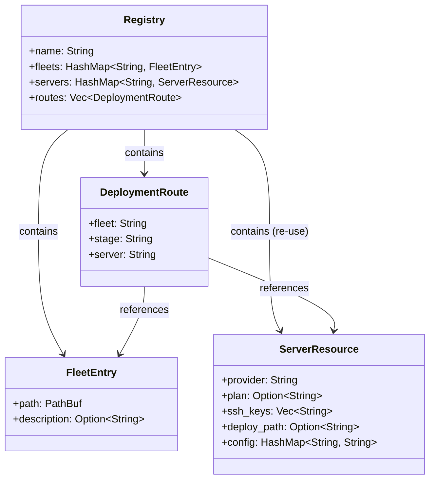
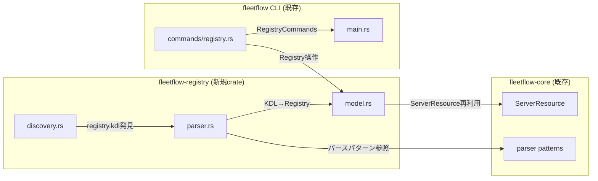
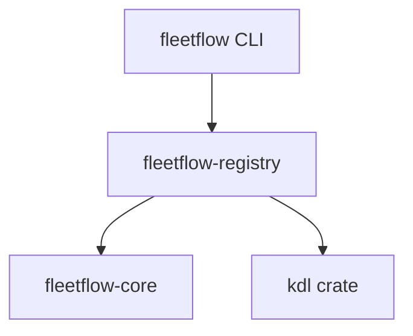
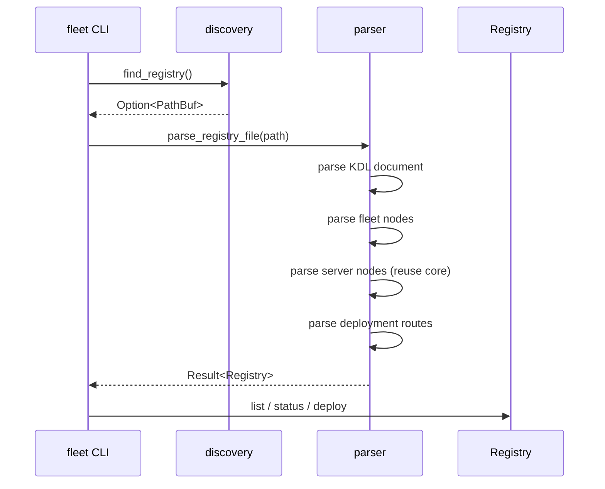

# Fleet Registry - 設計書

## 設計思想: Simplicity（シンプルさ）

Fleet Registry は既存のモデルとパターンを最大限に再利用する。新しい概念は3つだけ: `Registry`、`FleetEntry`、`DeploymentRoute`。

### 型の分類

- **data**: `Registry`, `FleetEntry`, `DeploymentRoute` — 純粋なデータ構造
- **calculations**: `parse_registry()`, `resolve_route()` — 入力→出力の純粋関数
- **actions**: `discover_registry()`, CLI ハンドラ — ファイルI/O、Docker API呼び出し

### Straightforward原則

```
fleet-registry.kdl → parse → Registry struct → resolve route → deploy
```

## データモデル

### 構造定義

```rust
/// Fleet Registry — 複数fleetとサーバーの統合管理
pub struct Registry {
    /// Registry名（リポジトリ識別子）
    pub name: String,
    /// Fleet定義のマップ（fleet名 → FleetEntry）
    pub fleets: HashMap<String, FleetEntry>,
    /// サーバー定義のマップ（server名 → ServerResource）
    /// 既存の fleetflow-core::ServerResource を再利用
    pub servers: HashMap<String, ServerResource>,
    /// デプロイルーティング
    pub routes: Vec<DeploymentRoute>,
}

/// 個別FleetFlowプロジェクトへの参照
pub struct FleetEntry {
    /// Registryルートからの相対パス
    pub path: PathBuf,
    /// 説明（オプション）
    pub description: Option<String>,
}

/// デプロイルーティング: fleet+stage → server
pub struct DeploymentRoute {
    /// 対象fleet名
    pub fleet: String,
    /// 対象stage名
    pub stage: String,
    /// デプロイ先server名
    pub server: String,
}
```

### モデルの関係性



## アーキテクチャ

### コンポーネント構成



### クレート構成

```
crates/fleetflow-registry/
├── Cargo.toml
├── src/
│   ├── lib.rs          # モジュール公開
│   ├── model.rs        # Registry, FleetEntry, DeploymentRoute
│   ├── parser.rs       # fleet-registry.kdl パーサー
│   └── discovery.rs    # registry.kdl 発見ロジック
```

### 依存関係



`fleetflow-registry` は `fleetflow-core` に依存して `ServerResource` を再利用する。

## コンポーネント詳細

### discovery.rs — Registry発見

**責務**: fleet-registry.kdl の自動発見

```rust
/// fleet-registry.kdl を発見する
///
/// 検索順序:
/// 1. FLEET_REGISTRY_PATH 環境変数
/// 2. カレントディレクトリの fleet-registry.kdl
/// 3. 上方向探索
pub fn find_registry() -> Option<PathBuf>
```

既存の `fleetflow-core::find_project_root()` と同じパターン。見つからない場合は `None`（エラーではない — Registry は必須ではない）。

### parser.rs — KDLパーサー

**責務**: fleet-registry.kdl を Registry 構造体にパース

```rust
/// KDL文字列を Registry にパース
pub fn parse_registry(content: &str) -> Result<Registry>

/// KDLファイルを Registry にパース
pub fn parse_registry_file(path: &Path) -> Result<Registry>
```

既存パーサー（`fleetflow-core::parser`）の `parse_server()` を再利用して `server` ノードをパース。

### CLI統合

**変更ファイル**: `crates/fleetflow/src/main.rs`, `crates/fleetflow/src/commands/registry.rs`

```rust
// Commands enum に追加
#[derive(Subcommand)]
enum Commands {
    // ... 既存コマンド ...

    /// Fleet Registryを管理
    #[command(subcommand)]
    Registry(RegistryCommands),
}

#[derive(Subcommand)]
enum RegistryCommands {
    /// 全fleetとサーバーの一覧
    List,
    /// 各fleet × serverの稼働状態
    Status,
    /// Registry定義に従ってデプロイ
    Deploy {
        /// デプロイ対象のfleet名
        fleet: String,
        /// ステージ名
        #[arg(short = 's', long)]
        stage: Option<String>,
        /// 確認なしで実行
        #[arg(short, long)]
        yes: bool,
    },
}
```

**重要**: `Registry` コマンドは設定ファイルのロード前にディスパッチする（既存の project root 検索とは異なるパス）。

## 実装手法

### パースフロー



### エラーハンドリング

```rust
#[derive(Debug, thiserror::Error)]
pub enum RegistryError {
    #[error("Registry ファイルが見つかりません")]
    NotFound,

    #[error("KDL パースエラー: {0}")]
    KdlParse(#[from] kdl::KdlError),

    #[error("不正な Registry 定義: {0}")]
    InvalidConfig(String),

    #[error("Fleet '{0}' が見つかりません")]
    FleetNotFound(String),

    #[error("Server '{0}' が見つかりません")]
    ServerNotFound(String),

    #[error("Route 解決エラー: fleet '{fleet}' stage '{stage}'")]
    RouteNotFound { fleet: String, stage: String },

    #[error("IO エラー: {0}")]
    Io(#[from] std::io::Error),
}
```

## テスト戦略

### ユニットテスト

- KDL パーサー: 正常系（全フィールド）、最小構成、不正KDL
- Route 解決: 正常マッチ、未定義fleet、未定義server
- Discovery: 環境変数、カレントディレクトリ、上方向探索

### 統合テスト

- tempdir に fleet-registry.kdl + fleet プロジェクト構造を作成
- `fleet registry list` の出力検証

## 実装チェックリスト

- [ ] `crates/fleetflow-registry/` crate 作成
- [ ] model.rs: Registry, FleetEntry, DeploymentRoute
- [ ] parser.rs: fleet-registry.kdl パーサー
- [ ] discovery.rs: registry.kdl 発見ロジック
- [ ] ユニットテスト
- [ ] Cargo.toml: workspace に追加
- [ ] CLI: Commands::Registry サブコマンド
- [ ] commands/registry.rs: list, status, deploy ハンドラ
- [ ] spec/design ドキュメント同期確認

## 変更履歴

### 2026-02-17: 初版作成

- **理由**: N fleets × M servers の統一管理の必要性
- **影響**: 新規 crate、CLI サブコマンド追加
