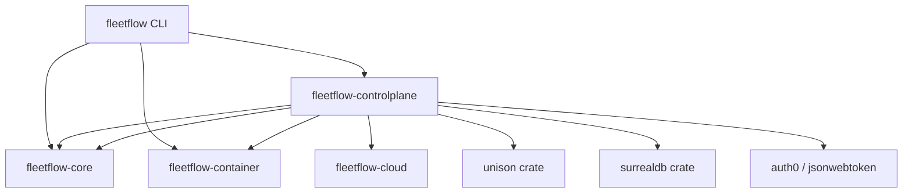
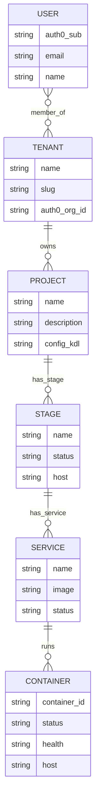
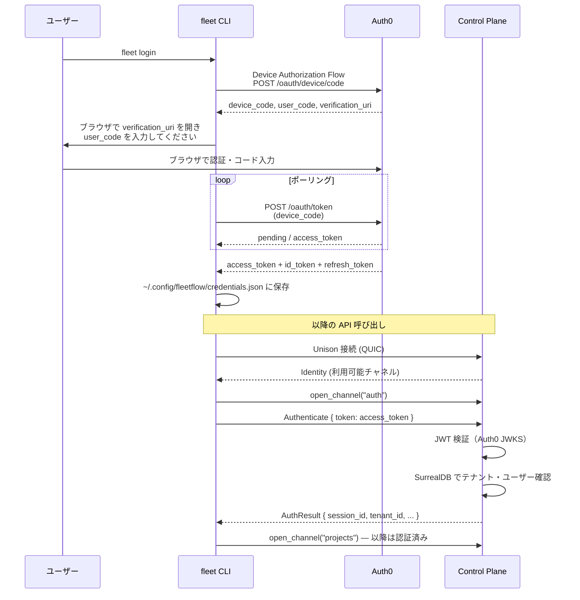
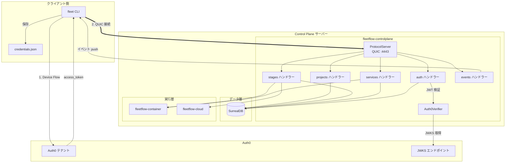
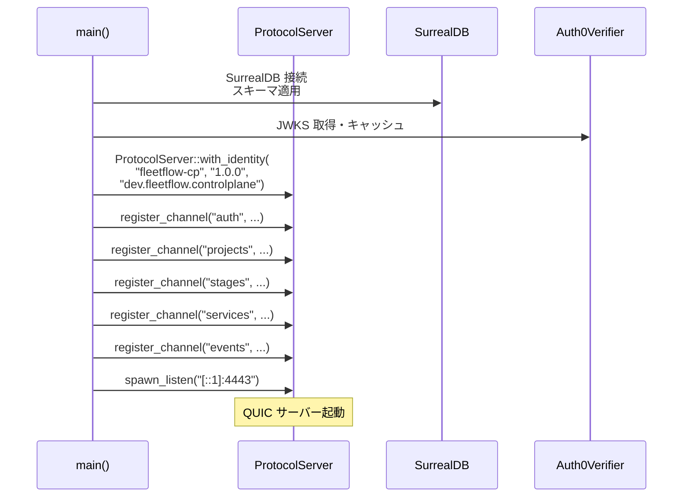
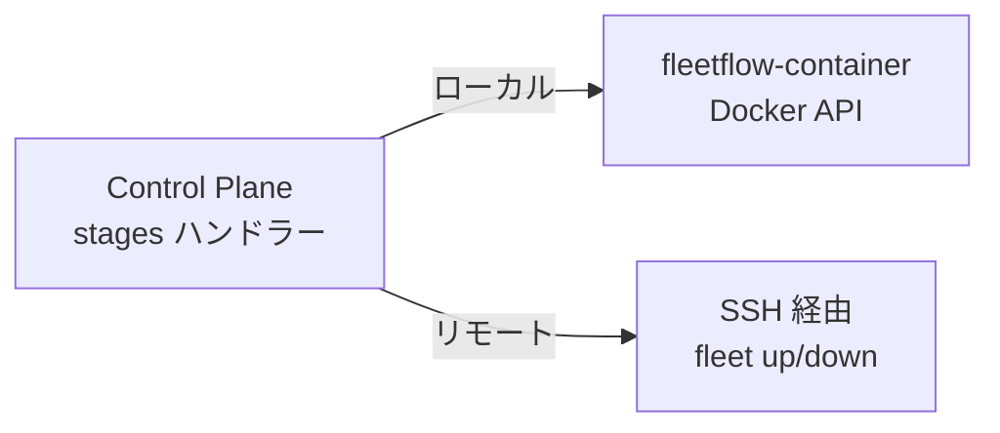

# Control Plane - 設計書

## 設計思想: Central Authority

Control Plane は FleetFlow の中央管理サーバーである。複数のホストに分散した FleetFlow エージェントを統合管理し、テナント・プロジェクト・ステージ・サービス・コンテナの階層構造でリソースを把握する。

通信には Unison Protocol（QUIC ベース、KDL スキーマ駆動）を採用し、認証には Auth0 を用いて全 API を保護する。状態管理には SurrealDB を使用する。

### 型の分類

- **data**: `Tenant`, `Project`, `Stage`, `Service`, `Container` — SurrealDB に永続化されるドメインモデル
- **calculations**: スキーマバリデーション、ステータス集約、権限チェック — 純粋関数
- **actions**: Unison チャネルハンドラー、DB クエリ、Auth0 トークン検証 — 副作用を伴う処理

### Straightforward 原則

```
fleet login → Auth0 token → Unison channel → Control Plane → SurrealDB
```

---

## 1. クレート構成

### 新規クレート

```
crates/fleetflow-controlplane/
├── Cargo.toml
├── src/
│   ├── lib.rs              # モジュール公開
│   ├── server.rs           # ProtocolServer 起動・チャネル登録
│   ├── auth.rs             # Auth0 トークン検証・ミドルウェア
│   ├── model.rs            # Tenant, Project, Stage, Service, Container
│   ├── db.rs               # SurrealDB 接続・クエリ
│   ├── handlers/
│   │   ├── mod.rs
│   │   ├── tenant.rs       # テナント管理チャネルハンドラー
│   │   ├── project.rs      # プロジェクト管理チャネルハンドラー
│   │   ├── stage.rs        # ステージ操作チャネルハンドラー
│   │   ├── service.rs      # サービス操作チャネルハンドラー
│   │   └── events.rs       # イベント配信チャネルハンドラー
│   └── schema.rs           # KDL スキーマ定義の読み込み
```

### 依存関係



`fleetflow-controlplane` は以下に依存する:

| 依存先 | 用途 |
|--------|------|
| `unison` | QUIC 通信（ProtocolServer / UnisonChannel） |
| `surrealdb` | 状態永続化 |
| `jsonwebtoken` | Auth0 JWT 検証 |
| `fleetflow-core` | KDL パーサー、データモデル（Project, Stage, Service の再利用） |
| `fleetflow-container` | コンテナ操作の委譲 |
| `fleetflow-cloud` | クラウドリソース操作の委譲 |

### CLI 側の変更

`crates/fleetflow/` に以下を追加:

```rust
// commands/login.rs — Auth0 認証フロー
// commands/connect.rs — Control Plane への接続

#[derive(Subcommand)]
enum Commands {
    // ... 既存コマンド ...

    /// Control Plane にログイン
    Login,

    /// Control Plane に接続してリモート操作
    #[command(subcommand)]
    Remote(RemoteCommands),
}

#[derive(Subcommand)]
enum RemoteCommands {
    /// リモートステージの状態を表示
    Ps {
        #[arg(short, long)]
        project: Option<String>,
    },
    /// リモートステージを起動
    Up {
        stage: String,
        #[arg(short, long)]
        project: Option<String>,
    },
    /// リモートステージを停止
    Down {
        stage: String,
        #[arg(short, long)]
        project: Option<String>,
    },
}
```

---

## 2. SurrealDB スキーマ

### テーブル定義

```sql
-- テナント（組織単位）
DEFINE TABLE tenant SCHEMAFULL;
DEFINE FIELD name ON tenant TYPE string;
DEFINE FIELD slug ON tenant TYPE string;
DEFINE FIELD auth0_org_id ON tenant TYPE option<string>;
DEFINE FIELD created_at ON tenant TYPE datetime DEFAULT time::now();
DEFINE FIELD updated_at ON tenant TYPE datetime DEFAULT time::now();
DEFINE INDEX idx_tenant_slug ON tenant FIELDS slug UNIQUE;

-- プロジェクト
DEFINE TABLE project SCHEMAFULL;
DEFINE FIELD name ON project TYPE string;
DEFINE FIELD description ON project TYPE option<string>;
DEFINE FIELD config_kdl ON project TYPE option<string>;  -- KDL 設定のスナップショット
DEFINE FIELD created_at ON project TYPE datetime DEFAULT time::now();
DEFINE FIELD updated_at ON project TYPE datetime DEFAULT time::now();

-- ステージ
DEFINE TABLE stage SCHEMAFULL;
DEFINE FIELD name ON stage TYPE string;                   -- local, dev, pre, live
DEFINE FIELD status ON stage TYPE string DEFAULT "stopped"; -- running, stopped, degraded
DEFINE FIELD host ON stage TYPE option<string>;           -- デプロイ先ホスト
DEFINE FIELD created_at ON stage TYPE datetime DEFAULT time::now();
DEFINE FIELD updated_at ON stage TYPE datetime DEFAULT time::now();

-- サービス
DEFINE TABLE service SCHEMAFULL;
DEFINE FIELD name ON service TYPE string;
DEFINE FIELD image ON service TYPE string;
DEFINE FIELD status ON service TYPE string DEFAULT "stopped";
DEFINE FIELD ports ON service TYPE option<array<object>>;
DEFINE FIELD env ON service TYPE option<object>;
DEFINE FIELD created_at ON service TYPE datetime DEFAULT time::now();
DEFINE FIELD updated_at ON service TYPE datetime DEFAULT time::now();

-- コンテナ（実行中インスタンス）
DEFINE TABLE container SCHEMAFULL;
DEFINE FIELD container_id ON container TYPE string;       -- Docker container ID
DEFINE FIELD status ON container TYPE string;             -- running, stopped, exited, etc.
DEFINE FIELD health ON container TYPE option<string>;     -- healthy, unhealthy, unknown
DEFINE FIELD started_at ON container TYPE option<datetime>;
DEFINE FIELD host ON container TYPE string;               -- 実行ホスト
DEFINE FIELD created_at ON container TYPE datetime DEFAULT time::now();
DEFINE FIELD updated_at ON container TYPE datetime DEFAULT time::now();
```

### リレーション定義

```sql
-- テナント → プロジェクト
DEFINE TABLE owns SCHEMAFULL TYPE RELATION FROM tenant TO project;
DEFINE FIELD created_at ON owns TYPE datetime DEFAULT time::now();

-- プロジェクト → ステージ
DEFINE TABLE has_stage SCHEMAFULL TYPE RELATION FROM project TO stage;
DEFINE FIELD created_at ON has_stage TYPE datetime DEFAULT time::now();

-- ステージ → サービス
DEFINE TABLE has_service SCHEMAFULL TYPE RELATION FROM stage TO service;
DEFINE FIELD created_at ON has_service TYPE datetime DEFAULT time::now();

-- サービス → コンテナ
DEFINE TABLE runs SCHEMAFULL TYPE RELATION FROM service TO container;
DEFINE FIELD created_at ON runs TYPE datetime DEFAULT time::now();

-- テナント → ユーザー（メンバーシップ）
DEFINE TABLE member_of SCHEMAFULL TYPE RELATION FROM user TO tenant;
DEFINE FIELD role ON member_of TYPE string DEFAULT "member"; -- owner, admin, member
DEFINE FIELD created_at ON member_of TYPE datetime DEFAULT time::now();
```

### リレーション図



---

## 3. Unison チャネル設計

### KDL スキーマ定義

```kdl
protocol "fleetflow-controlplane" version="1.0.0" {
    namespace "dev.fleetflow.controlplane"

    // 認証チャネル — ログイン後のセッション確立
    channel "auth" from="client" lifetime="transient" {
        request "Authenticate" {
            field "token" type="string" required=#true
            field "tenant_slug" type="string"

            returns "AuthResult" {
                field "session_id" type="string" required=#true
                field "tenant_id" type="string" required=#true
                field "user_id" type="string" required=#true
                field "permissions" type="array" required=#true
            }
        }
    }

    // プロジェクト管理チャネル
    channel "projects" from="client" lifetime="persistent" {
        request "ListProjects" {
            field "tenant_id" type="string" required=#true

            returns "ProjectList" {
                field "projects" type="array" required=#true
            }
        }

        request "GetProject" {
            field "project_id" type="string" required=#true

            returns "ProjectDetail" {
                field "project" type="json" required=#true
                field "stages" type="array" required=#true
            }
        }

        request "SyncProject" {
            field "project_id" type="string" required=#true
            field "config_kdl" type="string" required=#true

            returns "SyncResult" {
                field "project_id" type="string" required=#true
                field "changes" type="array" required=#true
            }
        }
    }

    // ステージ操作チャネル
    channel "stages" from="client" lifetime="persistent" {
        request "StageUp" {
            field "project_id" type="string" required=#true
            field "stage_name" type="string" required=#true

            returns "StageStatus" {
                field "stage_id" type="string" required=#true
                field "status" type="string" required=#true
                field "services" type="array" required=#true
            }
        }

        request "StageDown" {
            field "project_id" type="string" required=#true
            field "stage_name" type="string" required=#true

            returns "StageStatus" {
                field "stage_id" type="string" required=#true
                field "status" type="string" required=#true
                field "services" type="array" required=#true
            }
        }

        request "StagePs" {
            field "project_id" type="string"
            field "stage_name" type="string"

            returns "StageStatusList" {
                field "stages" type="array" required=#true
            }
        }
    }

    // サービス操作チャネル
    channel "services" from="client" lifetime="persistent" {
        request "ServiceStart" {
            field "stage_id" type="string" required=#true
            field "service_name" type="string" required=#true

            returns "ServiceStatus" {
                field "service_id" type="string" required=#true
                field "status" type="string" required=#true
                field "container" type="json"
            }
        }

        request "ServiceStop" {
            field "stage_id" type="string" required=#true
            field "service_name" type="string" required=#true

            returns "ServiceStatus" {
                field "service_id" type="string" required=#true
                field "status" type="string" required=#true
            }
        }

        request "ServiceLogs" {
            field "stage_id" type="string" required=#true
            field "service_name" type="string" required=#true
            field "tail" type="int"
            field "follow" type="bool"

            returns "LogStream" {
                field "lines" type="array" required=#true
            }
        }
    }

    // イベント配信チャネル（サーバー → クライアント）
    channel "events" from="server" lifetime="persistent" {
        event "ContainerStateChanged" {
            field "container_id" type="string" required=#true
            field "service_name" type="string" required=#true
            field "stage_name" type="string" required=#true
            field "project_name" type="string" required=#true
            field "old_status" type="string" required=#true
            field "new_status" type="string" required=#true
            field "timestamp" type="timestamp" required=#true
        }

        event "DeploymentProgress" {
            field "project_id" type="string" required=#true
            field "stage_name" type="string" required=#true
            field "phase" type="string" required=#true
            field "progress" type="number"
            field "message" type="string"
            field "timestamp" type="timestamp" required=#true
        }

        event "HealthCheckResult" {
            field "service_name" type="string" required=#true
            field "stage_name" type="string" required=#true
            field "status" type="string" required=#true
            field "details" type="json"
            field "timestamp" type="timestamp" required=#true
        }
    }
}
```

### チャネル一覧

| チャネル | 方向 | ライフタイム | パターン | 役割 |
|---------|------|------------|---------|------|
| `auth` | client → server | transient | request/returns | JWT 検証・セッション確立 |
| `projects` | client → server | persistent | request/returns | プロジェクト CRUD・KDL 同期 |
| `stages` | client → server | persistent | request/returns | ステージ起動・停止・状態取得 |
| `services` | client → server | persistent | request/returns | サービス個別操作・ログ取得 |
| `events` | server → client | persistent | event | コンテナ状態変更・デプロイ進捗の通知 |

---

## 4. 認証フロー

### Auth0 連携



### トークン管理

```rust
/// ~/.config/fleetflow/credentials.json
pub struct Credentials {
    pub access_token: String,
    pub refresh_token: Option<String>,
    pub expires_at: DateTime<Utc>,
    pub tenant_slug: Option<String>,
}
```

- `fleet login` で Device Authorization Flow を実行
- トークンは `~/.config/fleetflow/credentials.json` に保存
- 有効期限切れ時は `refresh_token` で自動更新
- `fleet logout` でトークンを削除

### サーバー側 JWT 検証

```rust
/// Auth0 JWKS を使った JWT 検証
pub struct Auth0Verifier {
    jwks_uri: String,           // https://{domain}/.well-known/jwks.json
    audience: String,           // API identifier
    issuer: String,             // https://{domain}/
    jwks_cache: RwLock<JwkSet>, // JWKS キャッシュ
}

impl Auth0Verifier {
    /// access_token を検証し、クレームを返す
    pub async fn verify(&self, token: &str) -> Result<Claims, AuthError>;
}
```

---

## 5. コンポーネント構成図

### 全体アーキテクチャ



### サーバー起動フロー



---

## 6. 既存コードとの統合

### fleetflow-core との関係

`fleetflow-core` の既存モデル（`Project`, `Stage`, `Service`）は KDL パース結果を表すローカルなデータ構造である。Control Plane のモデルはこれらを拡張し、SurrealDB のレコード ID やステータス情報を追加する。

```rust
// fleetflow-core: KDL パース結果（ローカル）
pub struct Project {
    pub name: String,
    pub stages: Vec<Stage>,
    pub services: Vec<Service>,
}

// fleetflow-controlplane: DB 永続化モデル（リモート）
pub struct CpProject {
    pub id: Thing,                    // SurrealDB レコード ID
    pub name: String,
    pub description: Option<String>,
    pub config_kdl: Option<String>,   // 元の KDL 設定
    pub created_at: DateTime<Utc>,
    pub updated_at: DateTime<Utc>,
}

// 変換: core → controlplane
impl From<&fleetflow_core::Project> for SyncProjectRequest {
    fn from(project: &fleetflow_core::Project) -> Self { ... }
}
```

### fleetflow-container との関係

Control Plane はコンテナ操作を `fleetflow-container` に委譲する。サーバーがローカルで Docker を操作する場合は直接呼び出し、リモートホストの場合は SSH 経由で `fleet` コマンドを実行する（Fleet Registry の SSH デプロイと同様のパターン）。



### fleetflow-cloud との関係

クラウドリソースの作成・削除は `fleetflow-cloud` のプロバイダー抽象を通じて実行する。Control Plane はプロバイダー選択とパラメータ受け渡しを担当する。

### fleetflow-registry との関係

Fleet Registry は複数プロジェクトのローカル管理ツールであり、Control Plane はそのリモート版と位置づけられる。将来的には `fleet registry sync` で Registry の定義を Control Plane に同期する機能を追加する。

---

## 7. 実装チェックリスト

### Phase 1: コア基盤

- [ ] `crates/fleetflow-controlplane/` crate 作成
- [ ] Cargo.toml: workspace に追加、依存関係設定
- [ ] model.rs: CpTenant, CpProject, CpStage, CpService, CpContainer
- [ ] db.rs: SurrealDB 接続、スキーマ適用、基本 CRUD
- [ ] server.rs: ProtocolServer 起動、チャネル登録

### Phase 1: 認証

- [ ] auth.rs: Auth0Verifier（JWKS 取得、JWT 検証）
- [ ] handlers/tenant.rs: Authenticate リクエストハンドラー
- [ ] CLI: `fleet login` コマンド（Device Authorization Flow）
- [ ] CLI: `fleet logout` コマンド
- [ ] credentials.json の読み書き

### Phase 1: プロジェクト管理

- [ ] handlers/project.rs: ListProjects, GetProject, SyncProject
- [ ] KDL 設定のパース・DB 保存
- [ ] CLI: `fleet remote ps` コマンド

### Phase 1: ステージ操作

- [ ] handlers/stage.rs: StageUp, StageDown, StagePs
- [ ] fleetflow-container との連携
- [ ] CLI: `fleet remote up`, `fleet remote down`

### Phase 1: イベント配信

- [ ] handlers/events.rs: ContainerStateChanged イベント
- [ ] コンテナ状態監視 → イベント発火

### Phase 1: KDL スキーマ

- [ ] `schemas/fleetflow-controlplane.kdl` スキーマ定義ファイル配置
- [ ] Unison コード生成の統合（ビルドスクリプトまたは手動）

### Phase 1: テスト

- [ ] ユニットテスト: モデル変換、JWT 検証（モック）
- [ ] 統合テスト: SurrealDB in-memory でのCRUD
- [ ] 統合テスト: Unison チャネル経由の Request/Response

### Phase 1: ドキュメント

- [ ] spec/ に Control Plane 仕様書を追加
- [ ] KDL スキーマファイルにコメント追加

---

## 変更履歴

### 2026-03-09: 初版作成

- **理由**: 分散ホスト上の FleetFlow 統合管理の必要性
- **影響**: 新規 crate、CLI サブコマンド追加、SurrealDB・Auth0・Unison Protocol の導入
