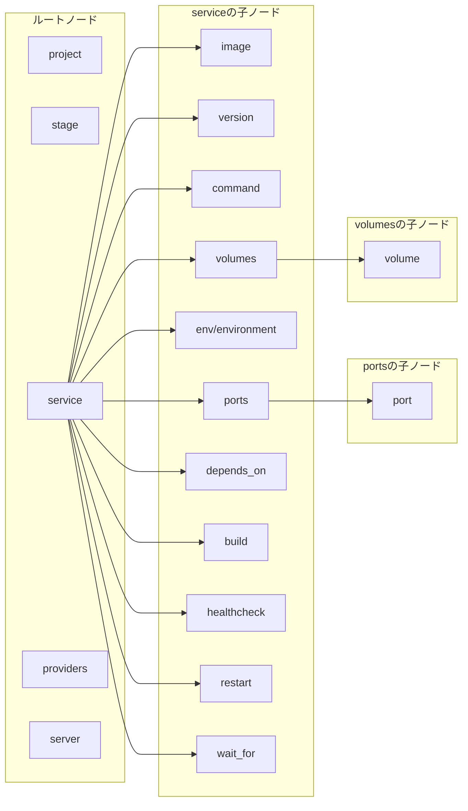
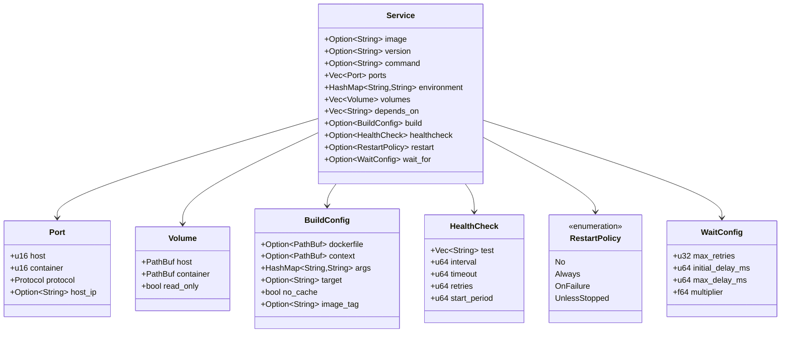
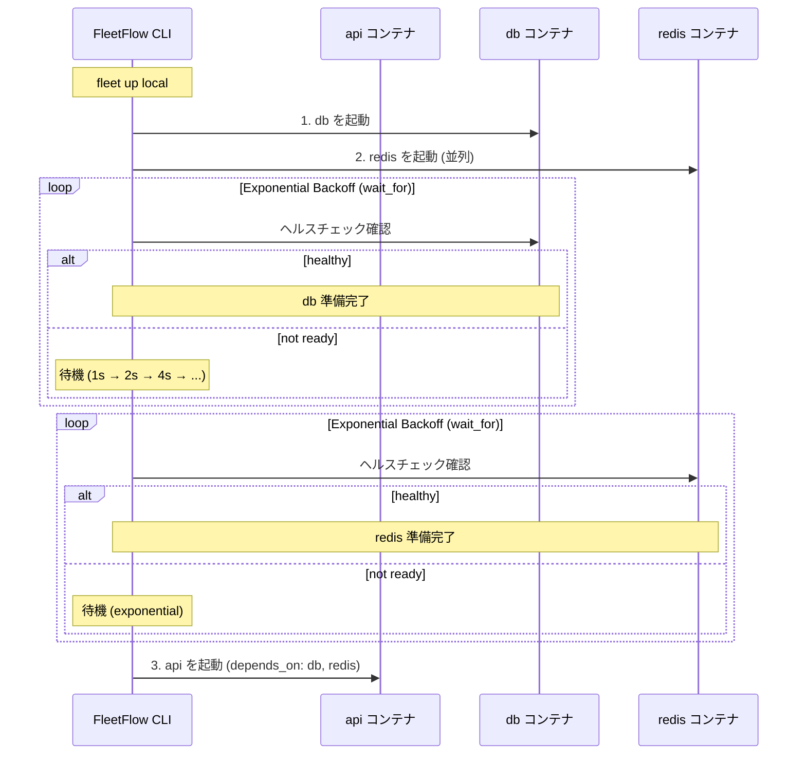
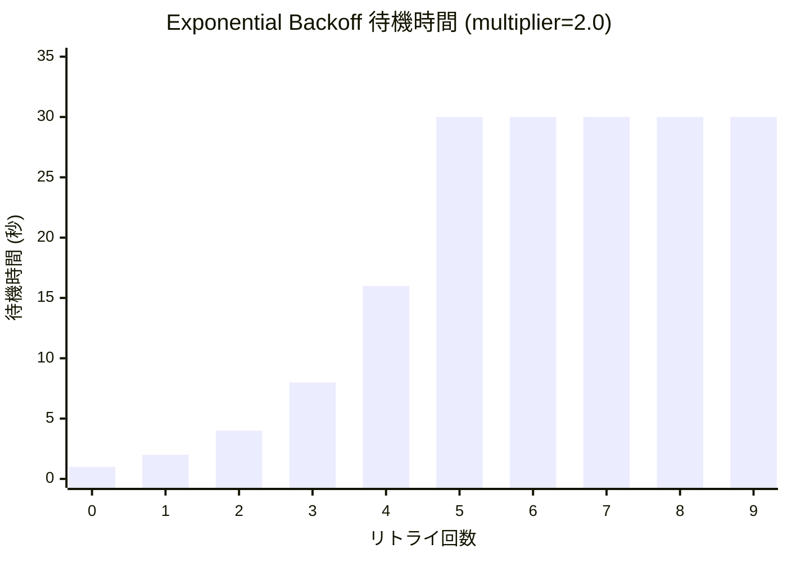
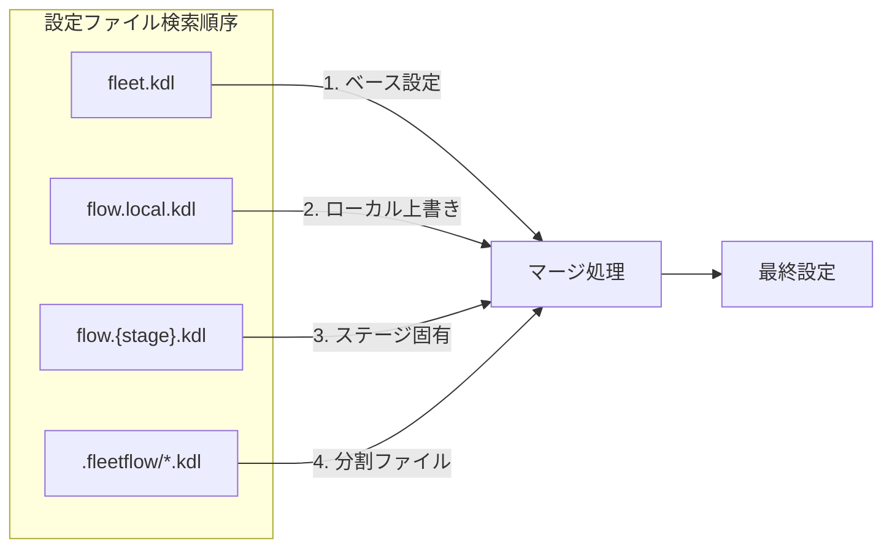
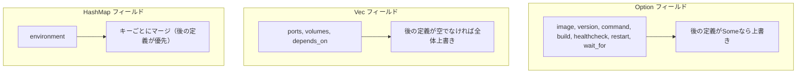
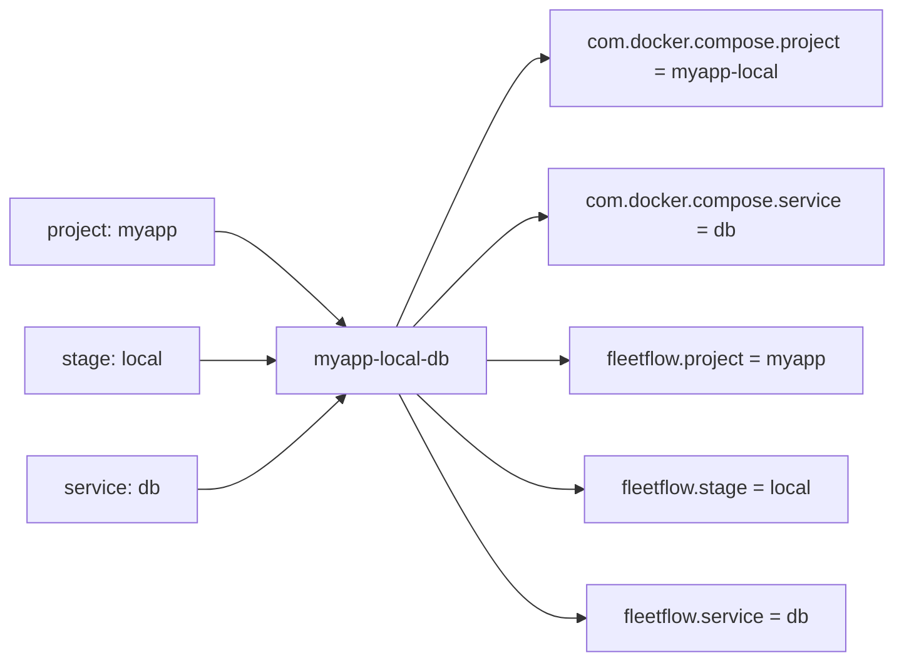

# KDL構造ビジュアルガイド

FleetFlowのKDL設定ファイル構造をMermaidグラフで視覚的に理解するためのガイドです。

## 全体構造

```mermaid
graph TB
    subgraph "fleet.kdl"
        PROJECT[project "name"]
        STAGE[stage "name"]
        SERVICE[service "name"]
        PROVIDERS[providers]
        SERVER[server "name"]
    end

    PROJECT --> STAGE
    STAGE --> SERVICE
    STAGE --> SERVER
    PROVIDERS --> SERVER
```

## ノード階層図



## サービス定義の詳細構造



## ステージとサービスの関係

```mermaid
flowchart TB
    subgraph "プロジェクト"
        P[project "myapp"]
    end

    subgraph "ステージ"
        L[stage "local"]
        D[stage "dev"]
        LIVE[stage "live"]
    end

    subgraph "サービス定義"
        DB[service "db"]
        API[service "api"]
        REDIS[service "redis"]
    end

    P --> L
    P --> D
    P --> LIVE

    L --> |"service"| DB
    L --> |"service"| API
    L --> |"service"| REDIS

    D --> |"service"| DB
    D --> |"service"| API

    LIVE --> |"service"| DB
    LIVE --> |"service"| API
    LIVE --> |"service"| REDIS
```

## 依存関係とExponential Backoff



## Exponential Backoff の待機時間



**デフォルト設定**:
- `initial_delay`: 1000ms (1秒)
- `max_delay`: 30000ms (30秒)
- `multiplier`: 2.0
- `max_retries`: 23回

## クラウドインフラ構造

```mermaid
graph TB
    subgraph "providers"
        SAKURA[sakura-cloud]
        CF[cloudflare]
    end

    subgraph "stage 'live'"
        SRV[server "app-server"]
        R2[r2-bucket "assets"]
        DNS[dns "example.com"]
    end

    SAKURA --> SRV
    CF --> R2
    CF --> DNS

    subgraph "server設定"
        SRV --> PLAN[plan core=4 memory=4]
        SRV --> DISK[disk size=100]
        SRV --> SSH[ssh-key]
        SRV --> ALIASES[dns_aliases]
    end
```

## ファイル読み込み順序とマージ



## マージルール



## コンテナ命名規則



## KDL構文の例

### 最小構成

```kdl
project "myapp"

stage "local" {
    service "db"
}

service "db" {
    image "postgres:16"
}
```

### フル設定

```kdl
project "myapp"

stage "local" {
    service "db"
    service "api"
}

service "db" {
    image "postgres:16"
    restart "unless-stopped"
    ports {
        port 5432 5432
    }
    env {
        POSTGRES_PASSWORD "secret"
    }
    volumes {
        volume "./data" "/var/lib/postgresql/data"
    }
    healthcheck {
        test "pg_isready -U postgres"
        interval 10
        timeout 5
        retries 3
    }
}

service "api" {
    image "myapp/api:latest"
    restart "unless-stopped"
    depends_on "db"
    wait_for {
        max_retries 10
        initial_delay 1000
        max_delay 30000
        multiplier 2.0
    }
    ports {
        port 3000 3000
    }
    env {
        DATABASE_URL "postgres://postgres:secret@db:5432/postgres"
    }
    build {
        dockerfile "Dockerfile"
        context "."
        target "production"
    }
}
```

## 関連ドキュメント

- [KDL構文リファレンス](../spec/02-kdl-parser.md)
- [OrbStack連携ガイド](01-orbstack-integration.md)
- [Dockerビルドガイド](02-docker-build.md)
- [CI/CDデプロイガイド](03-ci-deployment.md)
