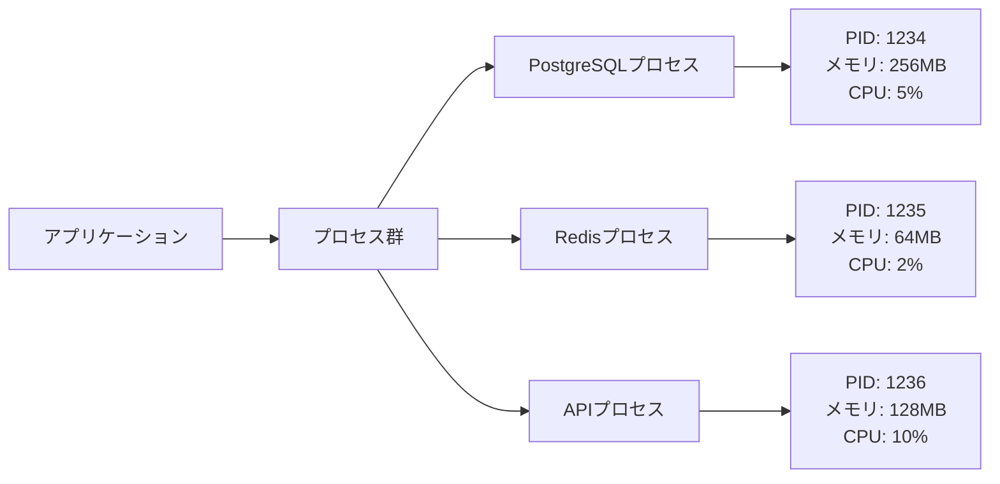
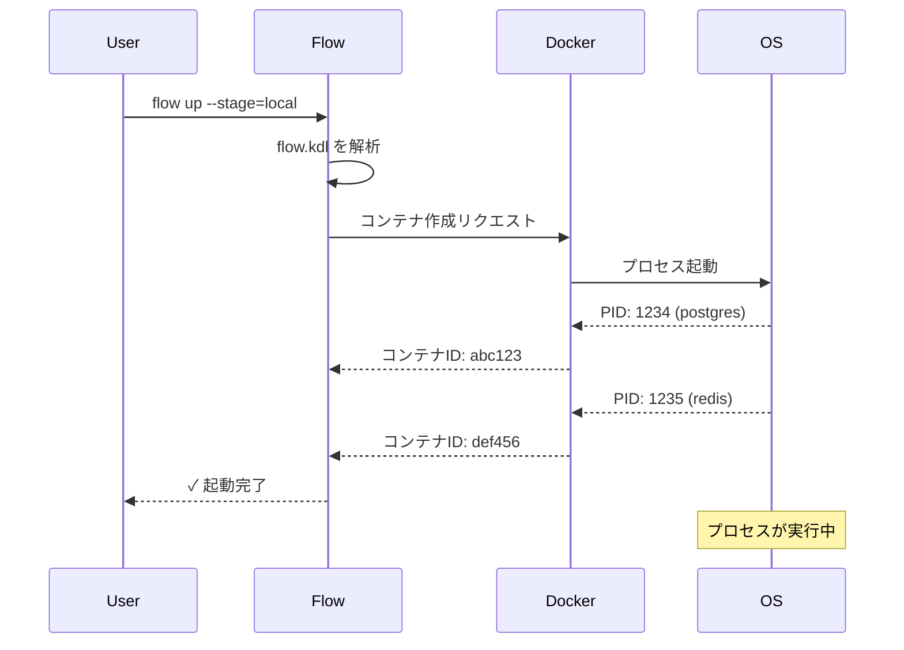
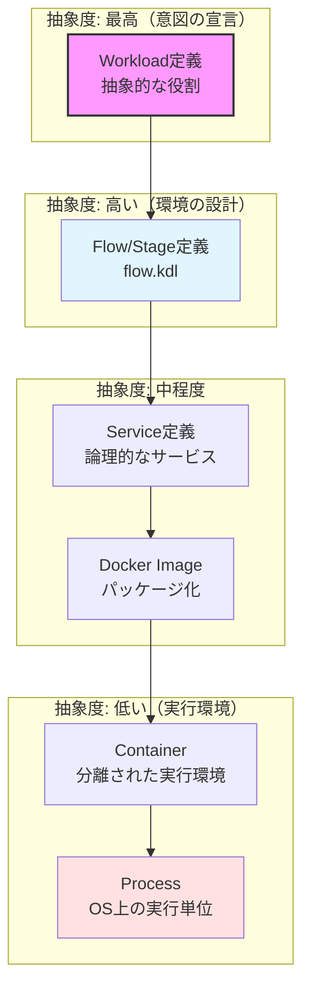
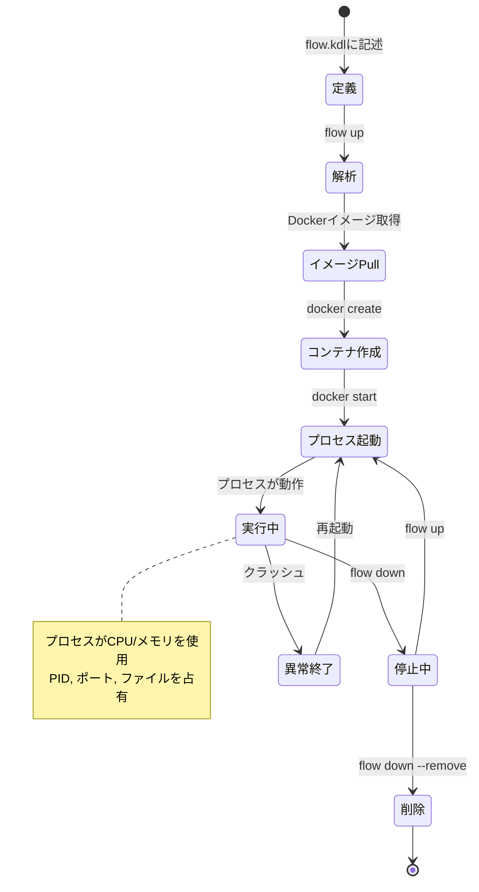

# Core Concept - 仕様書

## コンセプト

### プロセスとFlow

#### 全てはプロセスである

**プロセス**とは、OS上で実行される最小単位です。全てのアプリケーションは最終的にプロセスとして実行されます。



#### FlowとProcessの関係

**Flow**は、プロセスの**設計図**です。Flowを実行すると、複数のプロセスが起動します。



#### 抽象化レイヤー

FleetFlowは、プロセス管理を段階的に抽象化します：



#### プロセスライフサイクル



### 基本概念の定義

FleetFlowでは2つの基本概念を使用します：

#### サービス（Service）

**サービス**とは、FleetFlowにおける最小単位の実行可能なコンポーネントです。

サービスは以下の特性を持ちます：

1. **独立性**: 各サービスは独自のコンテナで実行される
2. **命名**: 一意な名前により識別される
3. **宣言的**: 望む状態を記述する（どう起動するかではなく、何が必要か）
4. **組み合わせ可能**: 他のサービスと組み合わせて環境を構築

#### 例

```kdl
// データベースサービス
service "postgres" {
    version "16"
}

// キャッシュサービス
service "redis" {
    version "7"
}

// アプリケーションサービス
service "api" {
    image "myapp:1.0.0"
    depends_on "postgres" "redis"
}
```

#### サービスの責務

- **単一責任**: 1つのサービスは1つの役割を持つ
  - ✅ Good: `service "postgres"` - データベース専用
  - ❌ Bad: `service "all-in-one"` - DB + API + フロントエンド

- **疎結合**: サービス間は疎結合を保つ
  - ネットワーク経由で通信
  - 明示的な依存関係（`depends_on`）

- **置き換え可能**: サービスは他の実装に置き換え可能
  - PostgreSQL → MySQL
  - Redis → Memcached

#### サービス vs コンテナ

| 観点         | サービス（Service）  | コンテナ（Container）   |
| ------------ | -------------------- | ----------------------- |
| **抽象度**   | 高い（論理的）       | 低い（物理的）          |
| **定義場所** | flow.kdl             | 実行時にDockerが作成    |
| **スコープ** | アプリケーション全体 | 1つの実行インスタンス   |
| **例**       | "postgres"サービス   | flow-postgres-1コンテナ |

**関係性**:

```
Service (flow.kdl)
  ↓ 変換
Docker Image (postgres:16)
  ↓ 起動
Container (flow-postgres-1)
```

#### サービスの状態遷移

```
[定義] --parse--> [設定] --create--> [作成済み] --start--> [実行中]
                                        ↓                      ↓
                                     [削除] <---stop--- [停止済み]
```

#### ステージ（Stage）

**ステージ**とは、アプリケーションがデプロイされる物理的・論理的な実行環境です。

##### ライブステージのメタファー

FleetFlowにおける「Stage」は、**ライブ演奏のステージ**をイメージしています。

| 環境 | ライブの比喩 | 説明 |
|------|-------------|------|
| **local** | 🏠 自宅で練習 | 個人の開発マシンで試行錯誤 |
| **dev** | 🎸 スタジオで合わせ | クラウド上でチームと統合 |
| **pre** | 🎤 本番会場でリハーサル | 本番と同じ環境でゲネプロ |
| **live** | 🎭 開演 | 実際のユーザーへ提供 |

バンドがライブに向けて準備するように、コードも段階を踏んで本番へ昇格していきます。

##### 二環境の原則 (The Dual-Environment Principle)

FleetFlowは、**「開発環境（Development）」と「本番環境（Production）」の最低2つの環境が必ず存在する**ことを設計の前提としています。

1. **分離の義務**: 開発時の試行錯誤が本番利用者に影響を与えてはならず、本番のデータが不用意に開発環境に漏れてはなりません。
2. **構成の対称性**: 開発と本番は「場所（Local/Cloud）」や「スケール（1/多）」は異なりますが、Flowとしての構成は可能な限り対称であるべきです。
3. **昇格のプロセス**: 開発環境で検証された設定（Flow）が、そのまま本番環境へ「昇格」していくワークフローを支援します。

##### 定義

ステージは以下の責務を持ちます：

1. **実行場所**: コードが実際に動作する場所（開発マシン or クラウド）
2. **サービス構成**: どのサービスを起動するか
3. **設定管理**: ステージ固有の変数を定義
4. **分離レベル**: ステージ間の独立性
5. **目的**: 各ステージの役割と責任

##### 標準的なステージ

| ステージ  | 名称       | 場所       | 目的           | 特徴                       |
| --------- | ---------- | ---------- | -------------- | -------------------------- |
| **local** | ローカル   | 開発マシン | 開発・デバッグ | 高速なフィードバックループ |
| **dev**   | 開発       | クラウド   | 統合テスト     | チーム共有、CI/CD連携      |
| **pre**   | プレ本番   | クラウド   | 本番前検証     | 本番環境に近い構成         |
| **live**  | ライブ     | クラウド   | ユーザー提供   | 高可用性、監視             |

##### ステージの定義例

```kdl
// local: 開発マシン上
// Docker Desktop / Podman
stage "local" {
    service "postgres"
    service "redis"
    service "api"

    variables {
        DEBUG "true"
        LOG_LEVEL "debug"
    }
}

// dev: クラウド開発環境
// Cloud Run / ECS / Kubernetes
stage "dev" {
    service "postgres"
    service "redis"
    service "api"

    variables {
        DEBUG "true"
        LOG_LEVEL "info"
    }
}

// pre: プレ本番環境（本番会場でのリハーサル）
// 本番と同じインフラ構成
stage "pre" {
    service "postgres"
    service "redis"
    service "api"
    service "worker"

    variables {
        DEBUG "false"
        LOG_LEVEL "info"
    }
}

// live: ライブ環境（開演）
// 高可用性・監視・バックアップ
stage "live" {
    service "postgres"
    service "redis"
    service "api"
    service "worker"

    variables {
        DEBUG "false"
        LOG_LEVEL "warn"
    }
}

// 共通のサービス定義
service "postgres" {
    version "16"
    port 5432:5432
}

service "redis" {
    version "7"
    port 6379:6379
}

service "api" {
    image "myapp"
    version "1.0.0"
    port 8080:3000
    depends_on "postgres" "redis"
}

service "worker" {
    image "myapp-worker"
    version "1.0.0"
    depends_on "postgres" "redis"
}
```

##### ステージの使い方

```bash
# ローカル開発（自宅練習）
flow up local

# クラウド開発環境（スタジオ）
flow up dev

# プレ本番検証（リハーサル）
flow up pre

# ライブデプロイ（開演）
flow up live
```

##### ステージの責務

Stageは以下を統合的に管理します：

- **実行場所**: local（開発マシン）or cloud（クラウド）
- **サービス構成**: どのサービスを起動するか
- **環境変数**: ステージ固有の設定値

##### ステージ間の違い

**Local (開発マシン)**

- コンテナランタイム: Docker Desktop / Podman
- リソース: 開発マシンのCPU/メモリ
- データ: モックまたは最小セット
- アクセス: 開発者のみ

**Dev (クラウド開発)**

- コンテナランタイム: Cloud Run / ECS
- リソース: 小規模（コスト重視）
- データ: 共有の開発用データ
- アクセス: チーム全体

**Pre (プレ本番)** 🎤

- コンテナランタイム: 本番と同じ
- リソース: 本番に近い構成
- データ: 本番の複製（匿名化）
- アクセス: QAチーム、承認者
- 比喩: 本番会場でのリハーサル（ゲネプロ）

**Live (ライブ)** 🎭

- コンテナランタイム: 高可用性構成
- リソース: スケーラブル
- データ: 実データ
- アクセス: エンドユーザー
- 比喩: 開演

### ビジョン

FleetFlowは、**設定ファイルを書く喜び**を提供します。

Docker Composeの手軽さを保ちつつ、KDLの美しさと可読性により、開発者が直感的に理解できる環境構築ツールを目指します。「設定より規約」の哲学により、最小限の記述で最大限の機能を実現します。

**自動インポート機能**により、`include` 文すら不要。ファイルを配置するだけで設定が完了します。

### 哲学・設計原則

#### 1. Convention over Configuration（設定より規約）

**哲学**: 開発者の時間は貴重である。明らかなことは書かなくて良い。

```kdl
// Bad: 冗長
service "postgres" {
    image "postgres:latest"
    protocol "tcp"
    read_only false
}

// Good: 規約により省略
service "postgres" {
    // image, protocol, read_onlyは自動推測
}
```

**トレードオフ**:

- 利点: 簡潔、学習コストが低い
- 欠点: 暗黙的な動作、デバッグが難しい場合も
- 判断: 開発体験を優先。明示的にも書ける設計。

#### 2. Progressive Disclosure（段階的な開示）

**哲学**: シンプルなことはシンプルに。複雑なことは可能に。

```kdl
// レベル1: 初心者 - 最小構成
service "api" {}

// レベル2: 中級者 - 一般的な設定
service "api" {
    ports {
        port 8080 3000
    }
}

// レベル3: 上級者 - 詳細制御
service "api" {
    ports {
        port 8080 3000 protocol="tcp" host_ip="127.0.0.1"
    }
}
```

#### 3. Declarative over Imperative（宣言的 > 命令的）

**哲学**: 「何を」したいかを宣言する。「どう」するかはツールに任せる。

```kdl
// 宣言的: 望む状態を記述
environment "production" {
    services "api" "db" "redis"
}

// ツールが以下を自動処理:
// - サービスの起動順序（依存関係解決）
// - ネットワーク設定
// - ヘルスチェック
```

### 他との違い

| 観点             | Docker Compose | FleetFlow           |
| ---------------- | -------------- | ------------------- |
| **記述言語**     | YAML           | KDL                 |
| **可読性**       | 中             | 高                  |
| **規約**         | 少ない         | 多い（自動推測）    |
| **モジュール化** | 限定的         | 自動インポート      |
| **学習曲線**     | 緩やか         | より緩やか          |
| **設定の分割**   | 手動include    | ディレクトリベース  |

**独自性**:

- KDLによる美しい構文
- サービス名からのイメージ自動推測
- **規約ベースの自動インポート**（`include` 文不要）
- ディレクトリベースのモジュール化
- 変数展開とテンプレート（計画中）

## 仕様

### 基本ルール

#### BR-001: 名前空間の分離

**原則**: Stage と Service は異なる名前空間に属する

**詳細**:

- Stageの名前とServiceの名前は独立して管理される
- 同じ名前のStageとServiceが共存可能
- この設計により、柔軟な命名が可能

**例**:

```kdl
// ✅ 許可: 同じ名前 "api" を使用
service "api" {
    image "myapp:1.0.0"
}

stage "api" {  // API開発専用ステージ
    service "api"
    service "postgres"
}

// ✅ 許可: 異なる名前を使用
service "backend" {
    image "myapp:1.0.0"
}

stage "local" {
    service "backend"
}
```

**理由**:

1. **異なる概念**: StageとServiceは異なる役割を持つ
   - Stage: 実行環境の定義（どこで、何を起動するか）
   - Service: コンテナの定義（何が、どう動くか）

2. **実用性**: 開発者が自然に感じる命名を妨げない
   - "api" という名前は、サービス名としてもステージ名としても一般的

3. **拡張性**: 将来的に他の概念（network, volumeなど）を追加しても混乱しない

#### BR-002: 一意性制約

**原則**: 同じ名前空間内では、名前は一意である

**詳細**:

- 同じ名前のServiceを複数定義することはできない
- 同じ名前のStageを複数定義することはできない
- 異なる名前空間であれば、同じ名前を使用できる（BR-001参照）

**例**:

```kdl
// ❌ エラー: 同じ名前のServiceを複数定義
service "postgres" {
    version "15"
}

service "postgres" {  // ← パースエラー
    version "16"
}

// ❌ エラー: 同じ名前のStageを複数定義
stage "local" {
    service "api"
}

stage "local" {  // ← パースエラー
    service "db"
}
```

### 機能仕様

#### FS-001: Service定義

**目的**: コンテナ化されたサービスを宣言的に定義

**入力**:

```kdl
service "api" {
    image "myapp:1.0.0"
    version "1.0.0"
    ports { ... }
    environment { ... }
    volumes { ... }
    depends_on "db" "redis"
}
```

**出力**: 内部の`Service`構造体

**振る舞い**:

1. サービス名を識別子として使用
2. imageが未指定の場合、サービス名+versionから推測
3. デフォルト値を適用
4. 依存関係を解決

**制約**:

- サービス名は一意
- 依存関係に循環参照は不可

#### FS-002: Stage定義

**目的**: ステージ（local/dev/pre/live等）ごとの設定を管理

**入力**:

```kdl
stage "live" {
    service "api"
    service "worker"
    service "db"

    variables {
        DEBUG "false"
        LOG_LEVEL "info"
    }
}
```

**出力**: 内部の`Stage`構造体

**振る舞い**:

1. ステージ名を識別子として使用
2. このステージで起動するサービスのリストを管理
3. ステージ固有の環境変数を定義
4. サービス定義は別途グローバルに定義される

**制約**:

- ステージ名は一意である必要がある
- 参照されるサービスは事前に定義されている必要がある
- ステージ名とサービス名は異なる名前空間であり、同じ名前を使用できる

#### FS-003: イメージ名の自動推測

**目的**: サービス名からDockerイメージ名を推測

**ロジック**:

```
if image が指定されている:
    → image をそのまま使用
else:
    → サービス名 + ":" + (version OR "latest")
```

**優先順位**:

1. **明示的な image 指定**: `image` フィールドが指定されている場合は、それを優先
2. **自動推測**: `image` が未指定の場合、サービス名と `version` から推測

**例**:

```kdl
// パターン1: 最小構成（自動推測）
service "postgres" {}
// → image: "postgres:latest"

// パターン2: version指定（自動推測）
service "postgres" {
    version "16"
}
// → image: "postgres:16"

// パターン3: 明示的なimage指定（自動推測なし）
service "api" {
    image "myorg/myapp:1.0.0"
}
// → image: "myorg/myapp:1.0.0"

// パターン4: imageとversionの両方指定（imageを優先）
service "api" {
    image "myorg/myapp:1.0.0"
    version "2.0.0"  // このversionは無視される
}
// → image: "myorg/myapp:1.0.0"
```

**注意事項**:

- `image` と `version` の両方が指定されている場合、`image` が優先され、`version` は無視される
- `version` フィールドは、`image` が未指定の場合のみ効果を持つ

#### FS-004: Port定義

**目的**: ポートマッピングを定義

**形式**:

```kdl
port {host_port} {container_port} [protocol="tcp|udp"] [host_ip="IP"]
```

**デフォルト**:

- protocol: "tcp"
- host_ip: 0.0.0.0（全インターフェース）

#### FS-005: Volume定義

**目的**: ボリュームマウントを定義

**形式**:

```kdl
volume "{host_path}" "{container_path}" [read_only=true|false]
```

**デフォルト**:

- read_only: false

### インターフェース仕様

#### 最小構成

```kdl
service "postgres" {}
```

これだけで以下が自動設定:

- image: "postgres:latest"
- その他フィールド: デフォルト値

#### 標準構成

```kdl
service "api" {
    image "myapp:1.0.0"

    ports {
        port 8080 3000
    }

    environment {
        NODE_ENV "production"
    }

    depends_on "db"
}

service "db" {
    version "16"  // → image: "db:16" として推測される
}

stage "live" {
    service "api"
    service "db"
}
```

#### フル構成

```kdl
service "api" {
    image "myapp:1.0.0"
    version "1.0.0"

    ports {
        port 8080 3000 protocol="tcp"
        port 8443 3443 protocol="tcp" host_ip="127.0.0.1"
    }

    environment {
        NODE_ENV "production"
        DATABASE_URL "postgresql://db:5432/mydb"
    }

    volumes {
        volume "./data" "/app/data"
        volume "./config" "/app/config" read_only=true
    }

    depends_on "db" "redis"
}
```

### 実用例: 名前空間の活用

#### 例1: 同じ名前を使用するケース

```kdl
// サービス定義: "api" という名前のWebアプリケーション
service "api" {
    image "mycompany/api:1.0.0"
    ports {
        port 8080 3000
    }
    depends_on "postgres"
}

service "postgres" {
    version "16"
}

// ステージ定義: "api" という名前のAPI開発専用環境
stage "api" {
    service "api"      // 上記のapiサービスを参照
    service "postgres"
    
    variables {
        DEBUG "true"
        API_ENV "development"
    }
}

// ステージ定義: "local" という名前のローカル開発環境
stage "local" {
    service "api"      // 同じapiサービスを参照
    service "postgres"
    
    variables {
        DEBUG "true"
        API_ENV "local"
    }
}
```

**説明**:
- `service "api"` と `stage "api"` は別の名前空間なので共存可能
- `stage "api"` は「API開発専用」という意味で命名
- 両方のステージが同じ `service "api"` を参照可能

#### 例2: 複数サービスを持つステージ

```kdl
service "frontend" {
    image "myapp/frontend:latest"
    ports {
        port 3000 80
    }
}

service "backend" {
    image "myapp/backend:latest"
    ports {
        port 8080 8080
    }
    depends_on "postgres" "redis"
}

service "postgres" {
    version "16"
}

service "redis" {
    version "7"
}

// フルスタック開発環境
stage "fullstack" {
    service "frontend"
    service "backend"
    service "postgres"
    service "redis"
}

// バックエンド開発のみ
stage "backend-only" {
    service "backend"
    service "postgres"
    service "redis"
}
```

**説明**:
- 各サービスは一度だけ定義
- ステージによって異なるサービスの組み合わせを起動

### 非機能仕様

#### パフォーマンス

- 100サービス定義のパース: < 1秒
- メモリ使用量: O(n) (nはサービス数)

#### セキュリティ

- ファイルパスのサニタイズ
- 環境変数の機密情報は別管理を推奨

#### 互換性

- 後方互換性: メジャーバージョン内で保証
- 前方互換性: 未知のフィールドは警告して無視

## 哲学的考察

### なぜKDLか

**YAML**: 広く使われているが、インデントの曖昧さ、型の暗黙変換、アンカー/エイリアスの複雑さ

**TOML**: シンプルだが、ネストが深いと読みにくい

**KDL**:

- 明確な構造（ブレース）
- 人間に優しい構文
- 型が明確
- コメントが自然

```kdl
// KDL: 美しく、明確
service "api" {
    ports {
        port 8080 3000
    }
}
```

vs

```yaml
# YAML: インデントに依存
services:
  api:
    ports:
      - "8080:3000"
```

### ユーザー体験

#### 初めて使う開発者

```kdl
// これだけで動く
service "postgres" {}
service "redis" {}
```

「え、これだけ？簡単！」→ 成功体験 → 継続使用

#### 熟練した開発者

```kdl
// 詳細制御も可能
service "api" {
    ports {
        port 8080 3000 host_ip="127.0.0.1"
    }
}
```

「細かく制御できる。良い」→ 信頼 → 本番採用

### 進化の方向性

#### Phase 1: 基本機能（現在）

- Service/Environment定義
- イメージ名推測
- 基本的なPort/Volume

#### Phase 2: モジュール化

- include機能
- 変数定義と展開
- テンプレート

#### Phase 3: 高度な機能

- 条件分岐
- 環境間の継承
- プラグインシステム

#### Phase 4: エコシステム

- Kubernetes変換
- Terraform統合
- Web UI

## 参考資料

### 影響を受けた技術

- Docker Compose: シンプルさ
- Kubernetes: 宣言的な設計
- Nix: 再現性
- KDL: 美しい構文

### 設計哲学の参考

- The Zen of Python: "Simple is better than complex"
- Rails: Convention over Configuration
- Unix Philosophy: "Do one thing well"
