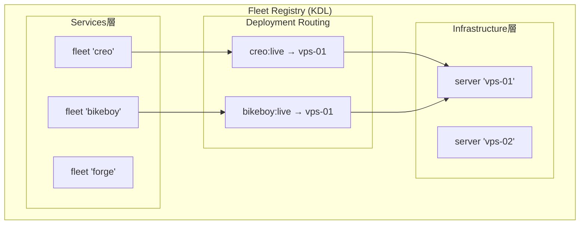

# Fleet Registry - 仕様書

## コンセプト

### ビジョン

Fleet Registryは、複数のFleetFlow プロジェクト（fleet）と計算資源（サーバー）を統一的に管理する仕組みである。NewSQLのコンピュート・ストレージ分離にインスパイアされ、「何を動かすか（Services層）」と「どこで動かすか（Infrastructure層）」を疎結合にする。

### 哲学・設計原則

- **疎結合**: サービスとインフラを独立して管理。1 fleet が N servers に、1 server が M fleets にマッピング可能
- **宣言的**: fleet-registry.kdl で全体像を宣言。ルーティングも宣言的に定義
- **既存互換**: 既存の `fleet deploy` が変わらず動作。Registry は上位レイヤーとして機能
- **段階的導入**: Phase 0 ではコード変更なし。KDL定義の集約だけで始められる

### システム概要図



## 仕様

### FS-001: Registry KDL構文

**目的**: 複数fleetとサーバーのメタ定義を一つのKDLファイルで宣言する

**KDL構文定義**:

```kdl
// Registry名（必須）
registry "chronista-fleet"

// Fleet定義
fleet "creo" {
    path "fleets/creo"
    description "Creo Memories - 永続記憶サービス"
}

fleet "bikeboy" {
    path "fleets/bikeboy"
    description "BikeBoy - 調査エージェント"
}

// サーバー定義（既存のServerResourceモデルを再利用）
server "vps-01" {
    provider "sakura-cloud"
    plan "4core-8gb"
    ssh-key "deployment"
    deploy-path "/opt/apps"
}

// デプロイルーティング
deployment {
    route fleet="creo" stage="live" server="vps-01"
    route fleet="bikeboy" stage="live" server="vps-01"
}
```

**制約**:
- `registry` ノードは必須。名前はリポジトリ識別子として使用
- `fleet` の `path` は registry.kdl からの相対パス
- `server` の定義は既存の cloud.kdl の `server` ノードと同じ構文
- `deployment` 内の `route` は fleet名、stage名、server名の組み合わせ

### FS-002: Fleet Entry

**目的**: 個別のFleetFlowプロジェクトへの参照を定義する

**入力/出力**:
- 入力: fleet名、相対パス、説明
- 出力: FleetEntry 構造体

**振る舞い**:
1. `path` で指定されたディレクトリに `.fleetflow/fleet.kdl` が存在することを検証
2. 存在しない場合はエラー（ただし `--no-verify` で検証スキップ可能）
3. `description` はオプション

### FS-003: Deployment Route

**目的**: fleetの特定stageをどのサーバーにデプロイするかをマッピングする

**振る舞い**:
1. `fleet` は registry 内の定義済み fleet を参照
2. `stage` は対象 fleet の定義済みステージを参照
3. `server` は registry 内の定義済みサーバーを参照
4. 同じ fleet+stage の組み合わせに複数サーバーは指定不可（1:1マッピング）
5. 1つのサーバーに複数の fleet+stage をマッピング可能

### FS-004: Registry Discovery

**目的**: fleet-registry.kdl を自動的に発見する

**検索順序**:
1. 環境変数 `FLEET_REGISTRY_PATH` が指定されている場合、そのパスを使用
2. カレントディレクトリの `fleet-registry.kdl` をチェック
3. カレントディレクトリから上に向かって `fleet-registry.kdl` を探す

**制約**:
- Registry が見つからない場合、通常の FleetFlow プロジェクトとして動作（後方互換）

### FS-005: CLI コマンド

**目的**: Registry の管理操作を CLI で提供する

#### `fleet registry list`

全 fleet とサーバーの一覧を表示:

```
Fleet Registry: chronista-fleet

Fleets:
  creo       fleets/creo        Creo Memories - 永続記憶サービス
  bikeboy    fleets/bikeboy     BikeBoy - 調査エージェント

Servers:
  vps-01     sakura-cloud       4core-8gb

Routes:
  creo:live       → vps-01
  bikeboy:live    → vps-01
```

#### `fleet registry status`

各 fleet × server の稼働状態を表示:

```
Fleet Registry: chronista-fleet

  Fleet       Stage    Server    Status
  creo        live     vps-01    Running (3/3 services)
  bikeboy     live     vps-01    Stopped
```

#### `fleet registry deploy <fleet>`

Registry 定義に従って指定 fleet をSSH経由でリモートデプロイ:

1. Registry から対象 fleet のデプロイルートを解決
2. ルートに紐づく server の `ssh-host` / `ssh-user` を取得
3. `deploy-path` と fleet名から リモートディレクトリを構築
4. デプロイ計画を表示
5. `--yes` 指定時のみ SSH 経由で `fleet deploy -s <stage> --yes` を実行

**SSH接続に必要なサーバー設定**:

```kdl
server "vps-01" {
    provider "sakura-cloud"
    ssh-host "153.xxx.xxx.xxx"   // SSH接続先（必須）
    ssh-user "root"              // SSHユーザー（省略時: "root"）
    deploy-path "/opt/apps"      // デプロイ先パス（必須）
}
```

**実行例**:

```bash
# 計画表示のみ（dry-run）
fleet registry deploy creo

# 実際にデプロイ実行
fleet registry deploy creo --yes

# ステージ指定
fleet registry deploy creo -s live --yes
```

**実行フロー**:

```
fleet registry deploy creo --yes
  → route解決: creo:live → vps-01
  → SSH: root@153.xxx.xxx.xxx
  → cd /opt/apps/creo && fleet deploy -s live --yes
  → リアルタイム出力表示
```

### 非機能仕様

- **パフォーマンス**: registry.kdl のパースは < 10ms
- **互換性**: Registry 未使用時の既存 fleet コマンドに影響なし
- **拡張性**: Phase 2 の `fleet serve` / `fleet agent` への自然な移行パス

## 変更履歴

### 2026-02-21: Phase 2 — SSH リモートデプロイ

- **理由**: `fleet registry deploy` を実際にSSH経由でリモート実行可能にする
- **影響**: ServerResource に `ssh_host` / `ssh_user` 追加、deploy ハンドラ書き換え

### 2026-02-17: 初版作成

- **理由**: N fleets × M servers の統一管理の必要性
- **影響**: 新規 crate `fleetflow-registry`、CLI サブコマンド追加
